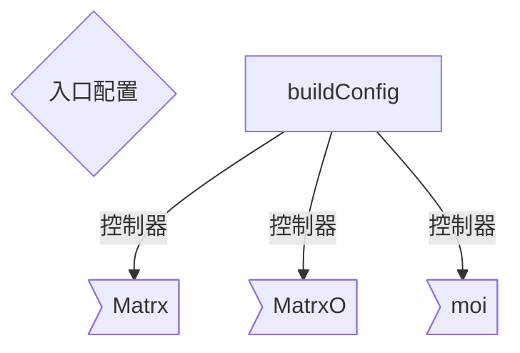

首页

# 相关资料

## 1

[gitlab](https://gitlab.corp.matrx.team/)
[禅道](https://chandao.corp.matrx.team/)
[日志平台](https://fed.corp.matrx.team/matrx-log/view?type=windows&env=test&isVip=false&time=1652350843240&pageIndex=1&pageSize=50&startDate=&endDate=&enterpriseId=&uid=)
[邮箱](https://outlook.office.com/mail/)
[发布平台](https://otp.corp.matrx.team/ "otp")
[]()

## 1

[]()

## 待整理

| [gitlab](https://gitlab.corp.matrx.team/) |                                             |                                      |                                                 |                                            |                                  |
| ----------------------------------------- | ------------------------------------------- | ------------------------------------ | ----------------------------------------------- | ------------------------------------------ | -------------------------------- |
| [JS](/note/JavaScript/)                   | [virtualList](/note/JavaScript/virtualList) | [worker](/note/JavaScript/worker)    | [quillEdit](/note/JavaScript/quillEdit)         |                                            |                                  |
| [归类](/note/meetingControl/)             | [Web 会中](/note/meetingControl/)           | [WebSDK](/note/cstMeeting/)          | [技术方案](/note/cstMeeting/TechnicalSolutions) | [Stock](/note/Stock/)                      |                                  |
| [模块](/note/modules/)                    | [IM](/note/modules/IM)                      | [peer](/note/modules/peer)           | [session](/note/modules/session)                | [MessageInput](/note/modules/MessageInput) | [Login](/note/modules/Login)     |
|                                           | [router](/note/modules/router)              | [LdapLogin](/note/modules/LdapLogin) | [sendMessage](/note/modules/sendMessage)        | [sendMessage](/note/modules/sendMessage)   | [receipt](/note/modules/receipt) |

// public
// private
// moi



### electron 显示右键菜单 限制只对编辑框或选中文本显示右键菜单

1.只对编辑框显示右键菜单 2.只在页面文字被选中的情况下显示右键菜单
直接上代码吧！

> 主进程 index.js

```js
const { app, BrowserWindow, ipcMain, Menu } = require("electron");
```

> 接受渲染进程消息

```js
ipcMain.on("show-context-menu", (event, param) => {
  // 制作右键菜单
  let template = [
    { role: "undo", label: "撤销" },
    { role: "selectAll", label: "全选" },
    // 分割线
    { type: "separator" },
    // enabled 设置选项是否可用
    { role: "cut", label: "剪切", enabled: param.cut },
    { role: "copy", label: "复制", enabled: param.copy },
    { role: "paste", label: "粘贴", enabled: param.paste }
  ];
  const menu = Menu.buildFromTemplate(template);
  // 显示菜单
  menu.popup(BrowserWindow.fromWebContents(event.sender));
});
```

> 渲染进程 index.html

```js
<script>
    const { ipcRenderer } = require('electron');
    // 监听右键
    document.addEventListener('contextmenu', function (e) {
        // 检查页面是否是有选择的文本 这里显示复制和剪切选项是否可见
        const selectText = window.getSelection().toString() ? true : false;
        if (
            // 只在有文本被选择的情况下才可以开启右键菜单
            selectText ||
            // 或者在输入框内
            e.target.tagName == "TEXTAREA" ||
            // 或者输入框是文本或者数字类型下才可以开启
            (e.target.tagName == "INPUT" && (e.target.type == "text" || e.target.type == "number"))
        ) {
            // 读取剪切板是否有文本 这里传递粘贴选项是否可见
            const paste = navigator.clipboard.readText() ? true : false;
            // 发送给主进程让它显示菜单
            ipcRenderer.send("show-context-menu", {
                paste,
                copy: selectText,
                cut: selectText,
            });
        }
    });
</script>
```
