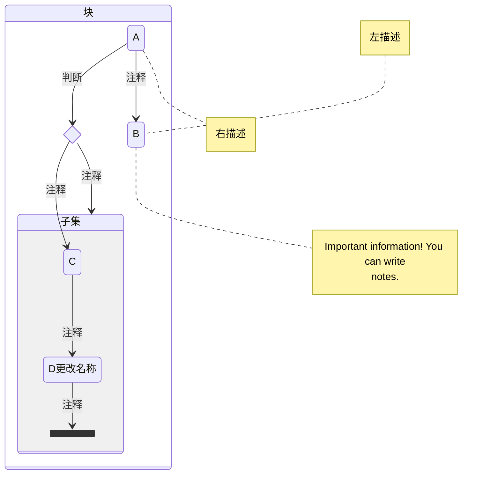
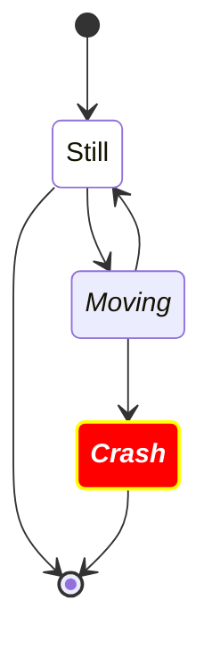
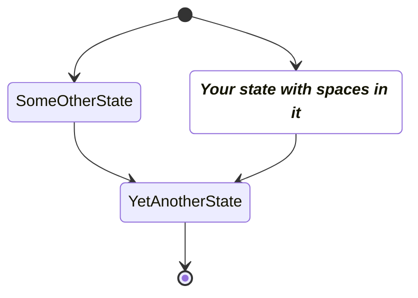
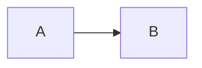

Readme.md

# docfiy 案例

## mermaid

### stateDiagram





```
stateDiagram
  direction TB

  accTitle: This is the accessible title
  accDescr: This is an accessible description

  classDef notMoving fill:white
  classDef movement font-style:italic;
  classDef badBadEvent fill:#f00,color:white,font-weight:bold,stroke-width:2px,stroke:yellow

  [*] --> Still:::notMoving
  Still --> [*]
  Still --> Moving:::movement
  Moving --> Still
  Moving --> Crash:::movement
  Crash:::badBadEvent --> [*]
```



```
stateDiagram
  classDef yourState font-style:italic,font-weight:bold,fill:white

  yswsii: Your state with spaces in it
  [*] --> yswsii:::yourState
  [*] --> SomeOtherState
  SomeOtherState --> YetAnotherState
  yswsii --> YetAnotherState
  YetAnotherState --> [*]
```

### graph

```mermaid
graph TD
  A[Christmas] -->|Get money| B(Go shopping)
  B --> C{Let me think}
  C -->|One| D[Laptop]
  C -->|Two| E[iPhone]
  C -->|Three| F[fa:fa-car Car]
  click index "/#/note/Vue/router?id=index" _black
```

```
graph TD
  A[Christmas] -->|Get money| B(Go shopping)
  B --> C{Let me think}
  C -->|One| D[Laptop]
  C -->|Two| E[iPhone]
  C -->|Three| F[fa:fa-car Car]
  click B "https://mermaid-js.github.io/"

graph LR
	A-->B
	click A callback "Tooltip for a callback"
	click B "http://cikaros.gitee.io" "This is a tooltip for a link"
```



## tab

<!-- tabs:start -->

<!-- tab:MessageInput -->

Hello!

<!-- tab:action_icon_group -->

Bonjour!

<!-- tab:Italian -->

Ciao!

<!-- tabs:end -->

<!-- tabs:start -->

```
<!-- tabs:start -->

<!-- tab:MessageInput -->

Hello!

<!-- tab:action_icon_group -->

Bonjour!

<!-- tab:Italian -->

Ciao!

<!-- tabs:end -->

<!-- tabs:start -->
```

## makedown

[mermaid](https://mermaid.js.org/syntax/flowchart.html)
