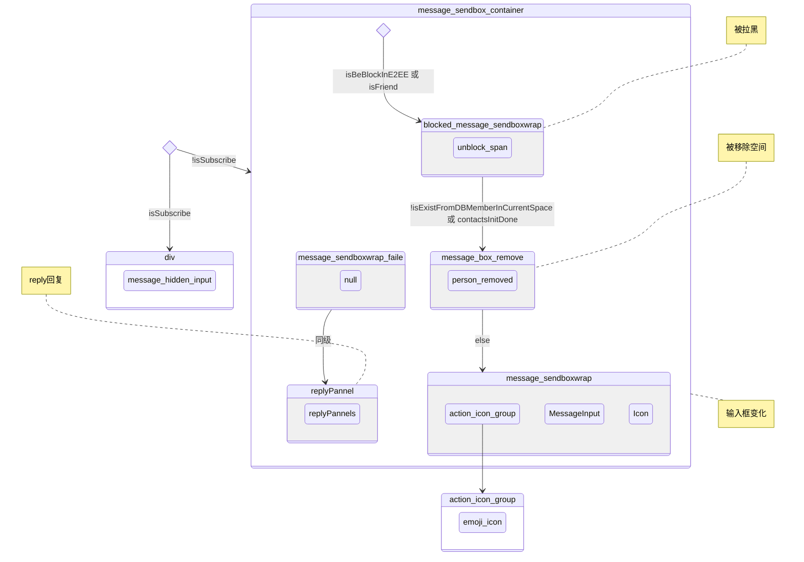
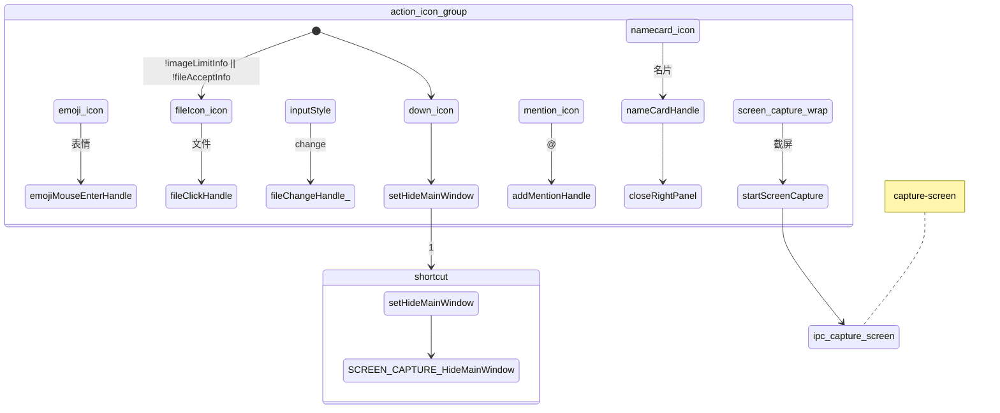

# 输入框

## 输入框模型

```mermaid
stateDiagram-v2
	state message_sendbox_container {
		state message_sendboxwrap_faile {
			null
		}
		state replyPannel {
			replyPannels
		}
    state blocked_message_sendboxwrap {
			unblock_span
		}
    state message_box_remove {
			person_removed
		}
    state message_sendboxwrap {
			action_icon_group1: action_icon_group
    	MessageInput
    	Icon
		}
		state Y1 <<choice>>
		Y1 --> blocked_message_sendboxwrap: isBeBlockInE2EE 或 isFriend
		blocked_message_sendboxwrap --> message_box_remove: !isExistFromDBMemberInCurrentSpace 或 contactsInitDone
		message_box_remove --> message_sendboxwrap: else
		message_sendboxwrap_faile --> replyPannel: 同级
		note left of blocked_message_sendboxwrap: 被拉黑
		note left of message_box_remove: 被移除空间
		note left of replyPannel: reply回复
  }
	state div {
		message_hidden_input
  }
	state action_icon_group {
		emoji_icon
  }
	state Y2 <<choice>>
	Y2 --> message_sendbox_container: !isSubscribe
	Y2 --> div: isSubscribe
	note right of message_sendbox_container: 输入框变化
	action_icon_group1 --> action_icon_group
```

```mermaid
stateDiagram-v2
	state action_icon_group {
		emoji_icon --> emojiMouseEnterHandle: 表情
		[*] --> fileIcon_icon: !imageLimitInfo || !fileAcceptInfo
		fileIcon_icon --> fileClickHandle: 文件
		inputStyle --> fileChangeHandle_: change
		namecard_icon --> nameCardHandle: 名片
		nameCardHandle --> closeRightPanel
		mention_icon --> addMentionHandle: @
		[*] --> down_icon
		down_icon --> setHideMainWindow
		screen_capture_wrap --> startScreenCapture: 截屏
  }
	startScreenCapture --> ipc_capture_screen
	note left of ipc_capture_screen: capture-screen
	state shortcut {
		setHideMainWindow2: setHideMainWindow
		setHideMainWindow2 --> SCREEN_CAPTURE_HideMainWindow
	}
	setHideMainWindow --> shortcut: 1
```
