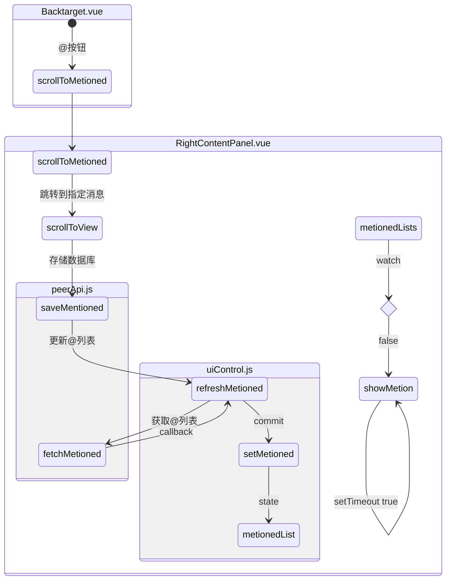
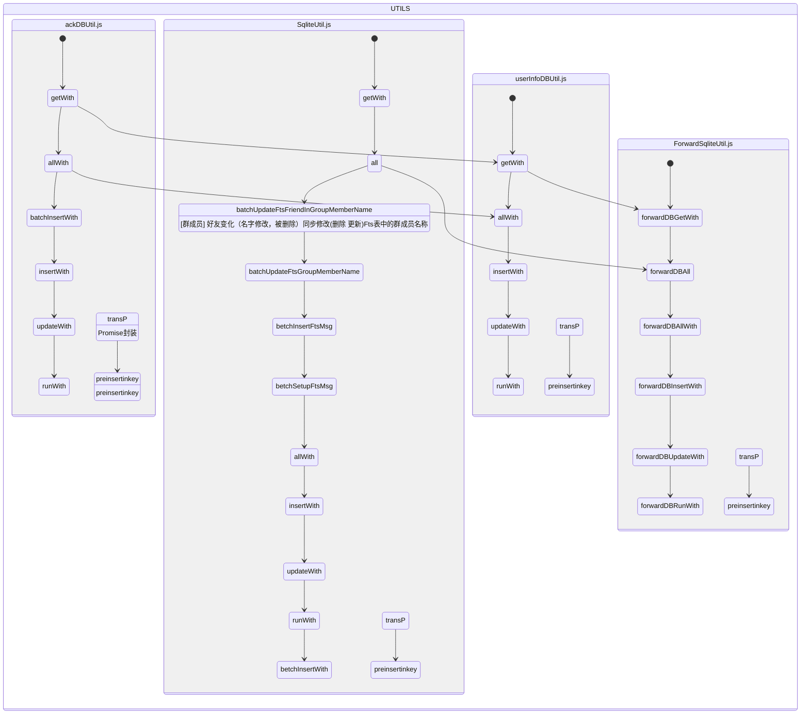
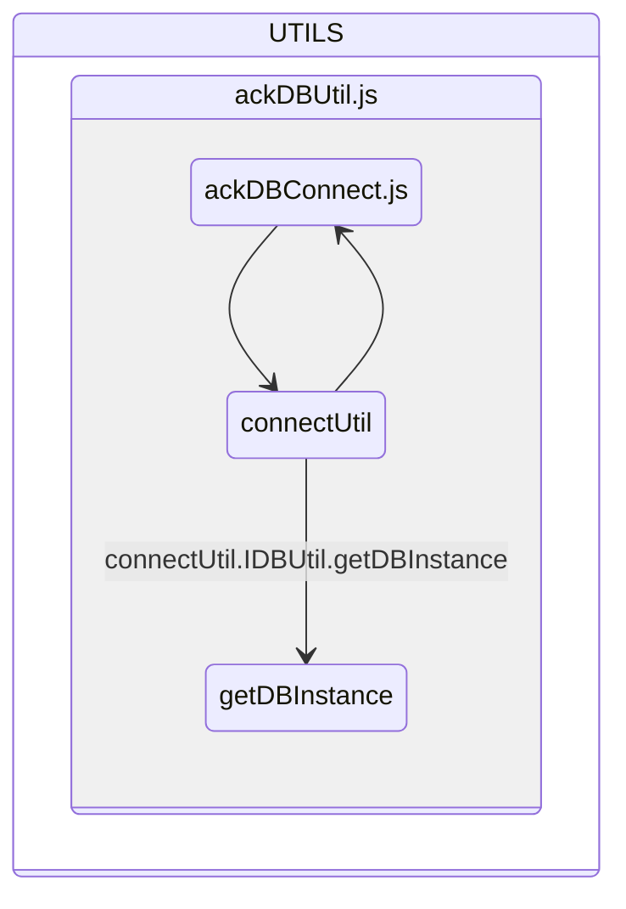
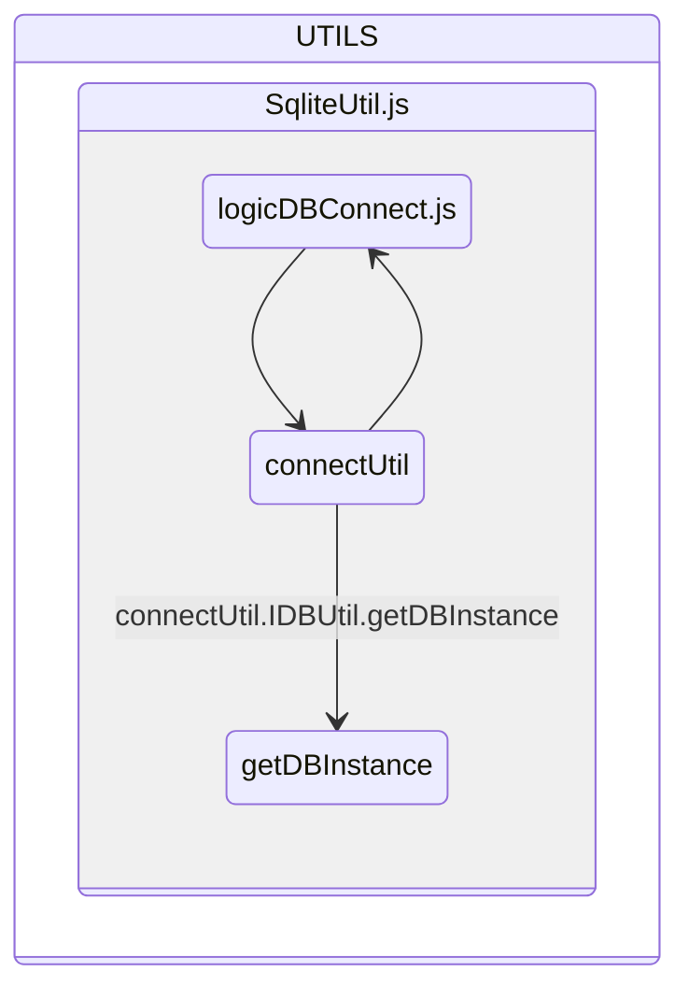
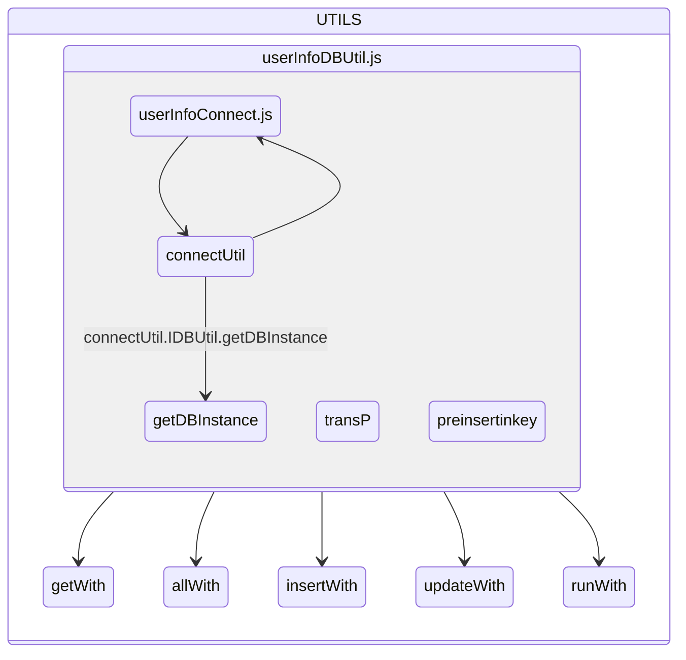
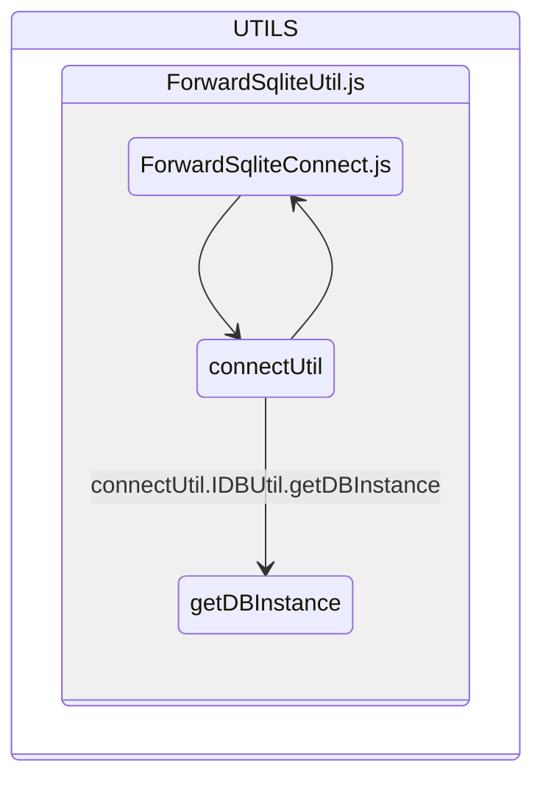
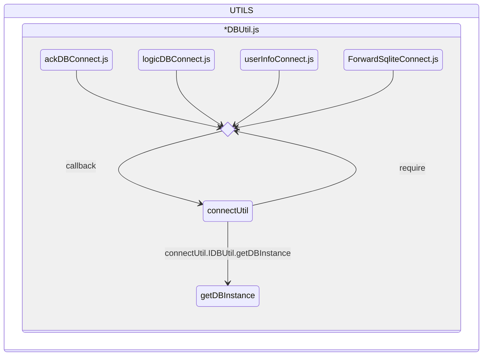

# 数据库 Map

| 文件名称                | 描述 | 命名规则                    | 描述                |
| ----------------------- | ---- | --------------------------- | ------------------- |
| ackDBUtil.js            |      |                             |                     |
| ackDBConnect.js         |      | `${vuid}.ackdb.enc`         | 消息缓存数据库      |
| SqliteUtil.js           |      |                             |                     |
| logicDBConnect.js       |      | `${vuid}.${spaceId}.db.enc` | 空间数据库          |
| userInfoDBUtil.js       |      |                             |                     |
| userInfoConnect.js      |      | `${vuid}.user.enc`          | 应用数据数据库      |
| ForwardSqliteUtil.js    |      |                             |                     |
| ForwardSqliteConnect.js |      | forward.db.enc              | 废弃                |
| appdataSqliteUtil.js    |      |                             |                     |
| appdataSqliteConnect.js |      | forward.db.enc              | loaclstorage 数据库 |

## @快捷按钮

## 数据库实例化

| name                  | L             | A    | U    | F   | 描述               |
| --------------------- | ------------- | ---- | ---- | --- | ------------------ |
| getDBPath             | spaceId、vuid | vuid | vuid | :x: | 计算数据库文件路径 |
| getDBPassword         | vuid          | vuid | vuid | :x: | 获取密码           |
| TableFromInitialFile  |               |      |      |     |                    |
| \_doUpgrade           |               |      |      |     |                    |
| \_getDBInitFiles      |               |      |      |     |                    |
| DB                    |               |      |      |     | 数据库实例         |
| DB.getDbIns           |               |      |      |     | 数据库创建与连接   |
| DB.connectDB          |               |      |      |     | 数据库连接         |
| DB.initDB             |               |      |      |     | 数据库初始化       |
| DB.exec               |               |      |      |     | SQL 查询           |
| DB.closeDB            |               |      |      |     | 关闭数据库         |
| DB.getDB              |               |      |      |     |                    |
| IDBUtil               |               |      |      |     |                    |
| IDBUtil.connect       |               |      |      |     |                    |
| IDBUtil.getDBInstance |               |      |      |     |                    |
| IDBUtil.disConnect    | :x:           |      |      |     |                    |

initDB

- [x] .
- [ ] 功能冗余，可以封装实例化
