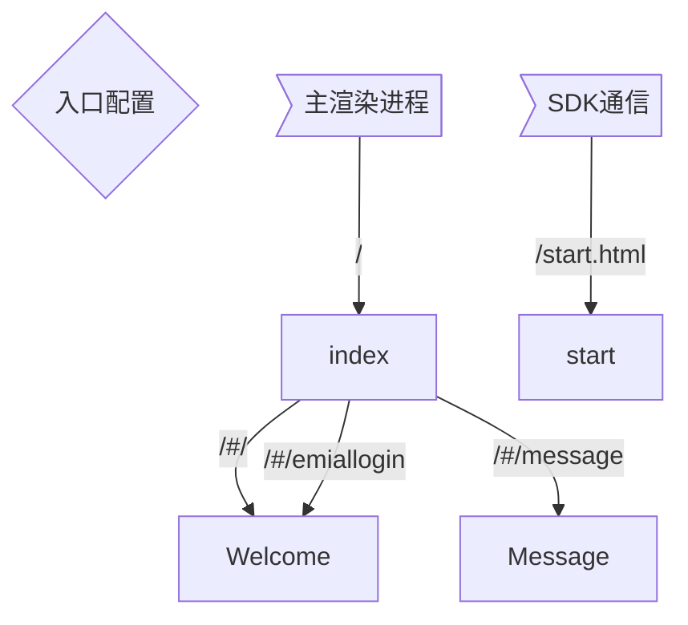
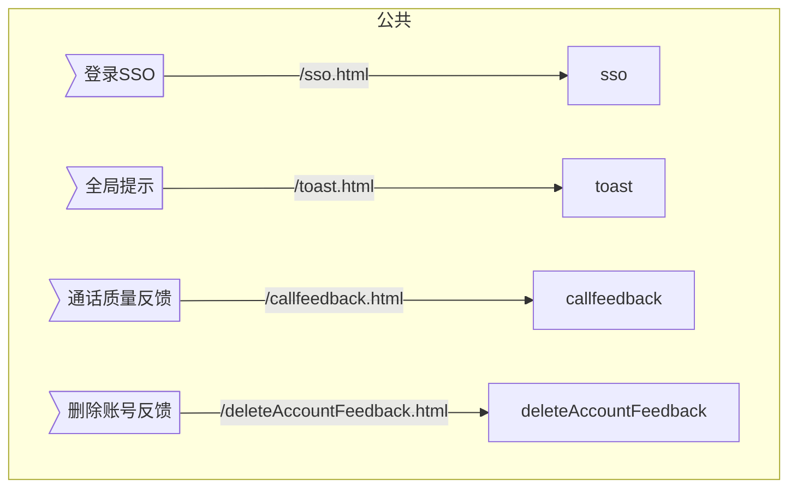
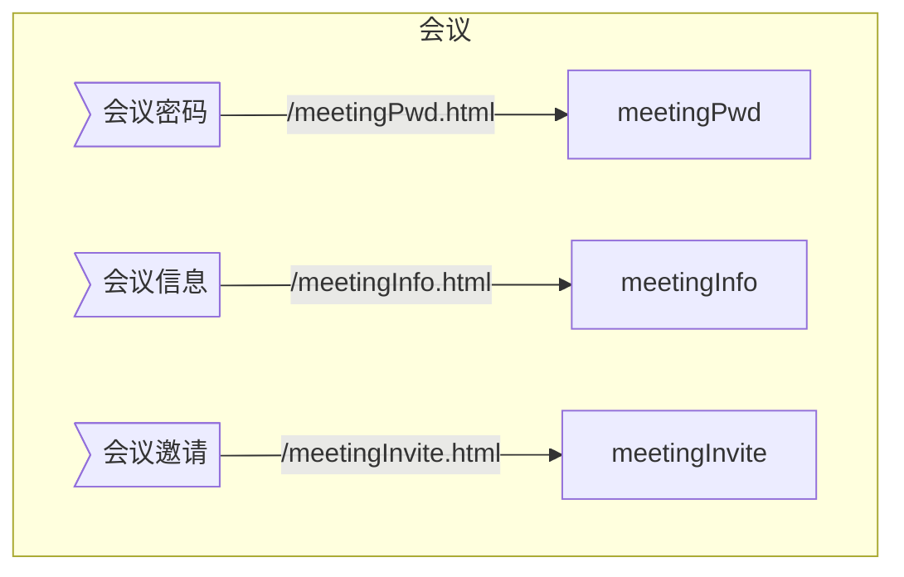
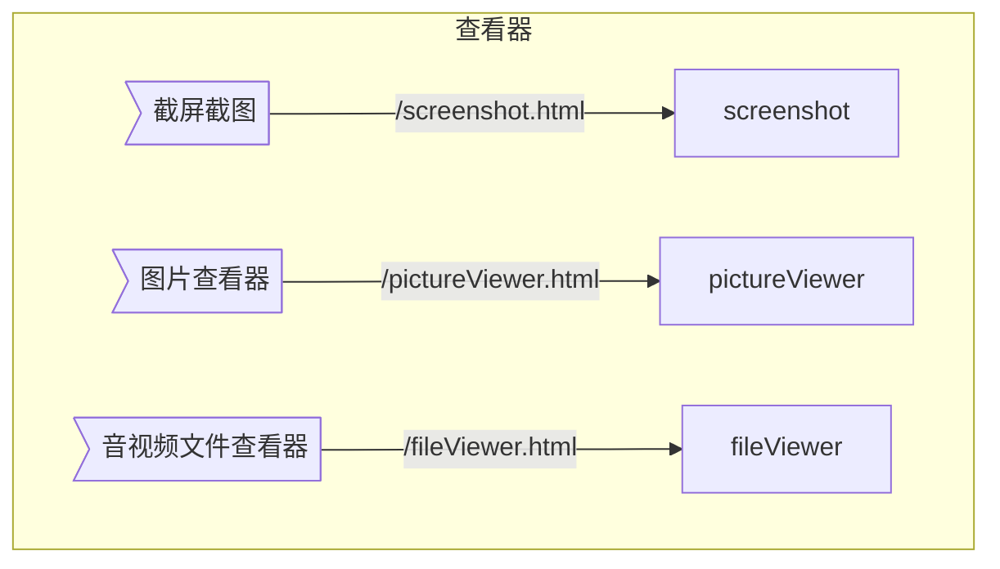
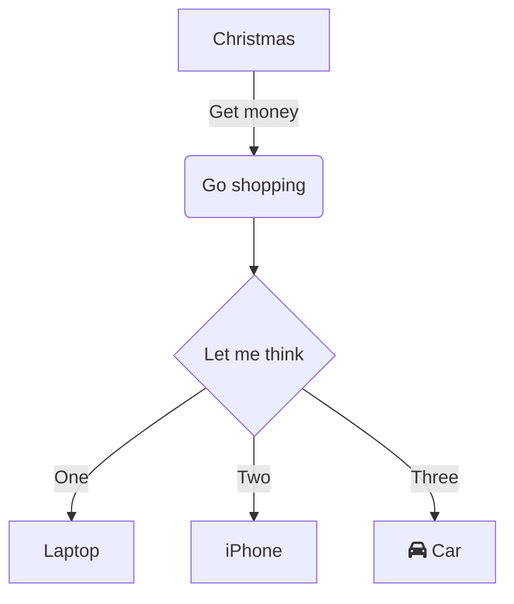

# 页面入口

```mermaid
graph TD
  VueConfig{入口配置}
  click VueConfig "/#/note/plug/vueConfig?id=pages" _blank
  index1>主渲染进程] --> |"/"|index
  click index "/#/note/Vue/router?id=index" _blank
  index -->|"/#/"| Welcome
  index -->|"/#/emiallogin"| Welcome
  index -->|"/#/message"| Message
  start1>SDK通信] --> |"/start.html"|start
  click start "/#/note/Vue/router?id=start" _blank
```

```mermaid
graph TD
  subgraph 公共
    sso1>登录SSO] --> |"/sso.html"|sso
    click sso "/#/note/Vue/router?id=sso" _blank
    toast1>全局提示] --> |"/toast.html"|toast
    click toast "/#/note/Vue/router?id=toast" _blank
    callfeedback1>通话质量反馈] --> |"/callfeedback.html"|callfeedback
    click callfeedback "/#/note/Vue/router?id=callfeedback" _blank
    deleteAccountFeedback1>删除账号反馈] --> |"/deleteAccountFeedback.html"|deleteAccountFeedback
    click deleteAccountFeedback "/#/note/Vue/router?id=deleteaccountfeedback" _blank
  end
```

```mermaid
graph TD
  subgraph 会议
    meetingPwd1>会议密码] --> |"/meetingPwd.html"|meetingPwd
    click meetingPwd "/#/note/Vue/router?id=meetingpwd" _blank
    meetingInfo1>会议信息] --> |"/meetingInfo.html"|meetingInfo
    click meetingInfo "/#/note/Vue/router?id=meetinginfo" _blank
    meetingInvite1>会议邀请] --> |"/meetingInvite.html"|meetingInvite
    click meetingInvite "/#/note/Vue/router?id=meetinginvite" _blank
  end
```

```mermaid
graph TD
  subgraph 查看器
    screenshot1>截屏截图] --> |"/screenshot.html"|screenshot
    click screenshot "/#/note/Vue/router?id=screenshot" _blank
    pictureViewer1>图片查看器] --> |"/pictureViewer.html"|pictureViewer
    click pictureViewer "/#/note/Vue/router?id=pictureviewer" _blank
    fileViewer1>音视频文件查看器] --> |"/fileViewer.html"|fileViewer
    click fileViewer "/#/note/Vue/router?id=fileviewer" _blank
  end
```

```mermaid
graph TD
  A[Christmas] -->|Get money| B(Go shopping)
  B --> C{Let me think}
  click index "/#/note/C/router?id=index"
  C -->|One| D[Laptop]
  C -->|Two| E[iPhone]
  C -->|Three| F[fa:fa-car Car]
  click C "https://mermaid-js.github.io/"
```
