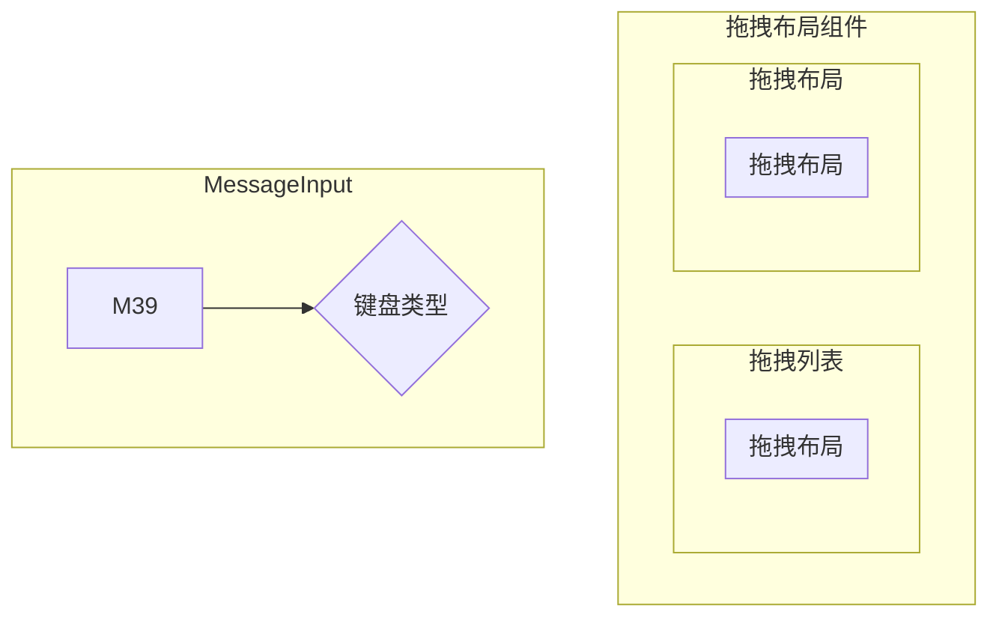

的说法是否

# web 项目

## 项目

> meeting control 会中项目

1. dev 开发
1. build 打包
1. start 运行

> proxy_local 代理

1. node index.js 运行代理

## 结构

项目嵌套`module-common`公共组件项目

# 会中布局

Sortable.js 是一款轻量级的拖放排序列表的 js 插件
[Sortable.js](https://github.com/SortableJS/Sortable)

## 语法

## vue draggable



// 布局数据
checkScreenObj
// 是否显示 ICON
isIconShow
// 布局名称
layoutName
// 布局 ID
templateId
// 用户列表数据
checkList
layoutTabList
// 布局区上限
dragMaxNum
// 布局数据
value

# 拖拽功能

```mermaid
option 配置项
  /**
   * @description 布局最大人数
   * @default 0
   */
  dragMaxNum: 1,
  /**
   * @description 是否显示设备类型
   * @default 0
   */
  isIconShow: true,

  /**
   * @description 选择器数据
   * @default []
   */
  option: Array<Options>;
```

# 功能点

拖拽、选择框、双击选择、全选、是否选、过滤用户、移除 模块选择

## 下拉问题

```
服务端获取，配合name获取样式，svg
layoutSelectList: [],

screenTypeList: [
  1, 2, 3, 4, 5, 6, 7, 8, 9, 10, 13, 16, 17, 20, 24, 25, 49,
].map((num) => {
  return { value: num, label: num + " Screen" };
}),
配合组件写死
```

## 名称修改

```
封装个组件提供props v-model 模板名称，可修改。
```

## 名称修改

```

```
