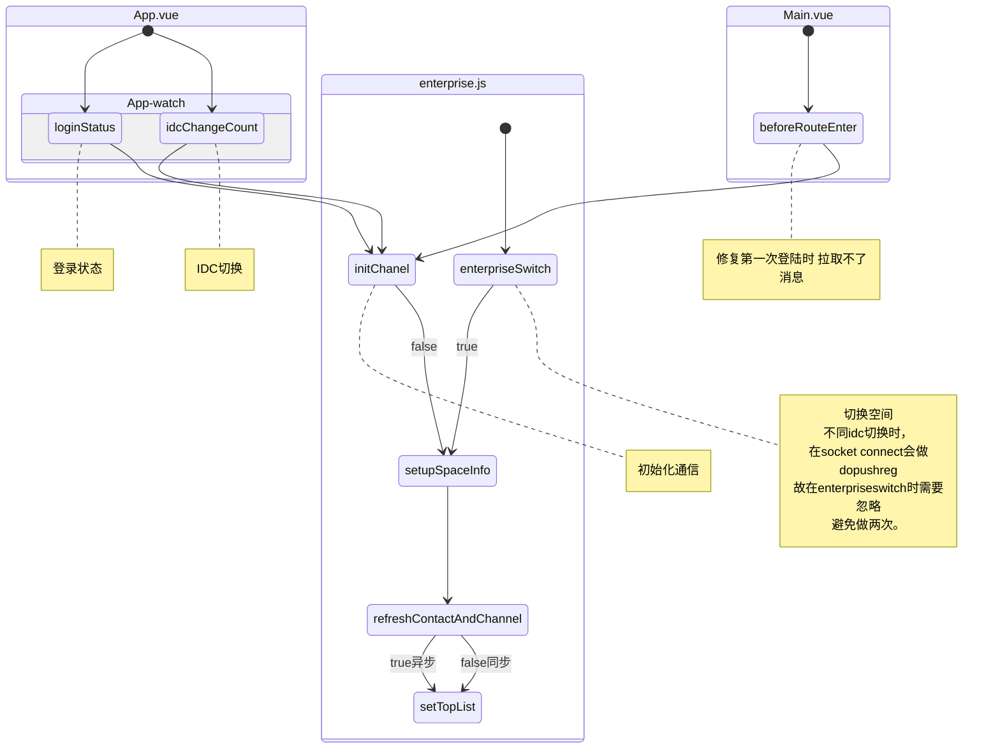
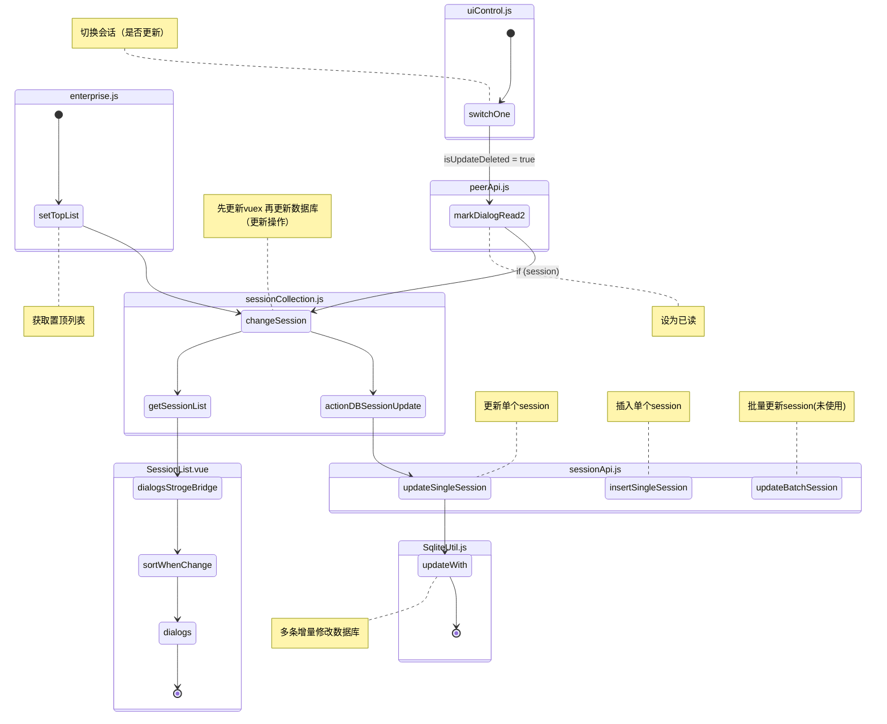

# 会话列表

## 获取置顶列表

<!-- tabs:start -->

#### **触发置顶获取**

```mermaid
stateDiagram
  state Main.vue {
    [*] --> beforeRouteEnter
    beforeRouteEnter --> initChanel
    note right of beforeRouteEnter : 修复第一次登陆时 拉取不了消息
  }
  beforeRouteEnter
  state App.vue {
    [*] --> idcChangeCount
    note right of idcChangeCount : IDC切换
    [*] --> loginStatus
    state App-watch {
      idcChangeCount --> initChanel
      loginStatus --> initChanel
      note right of loginStatus : 登录状态
    }
  }
  state enterprise.js {
    initChanel --> setupSpaceInfo : false
    note right of initChanel : 初始化通信
    [*] --> enterpriseSwitch
    note right of enterpriseSwitch
      切换空间
      不同idc切换时，
      在socket connect会做dopushreg
      故在enterpriseswitch时需要忽略
      避免做两次。
    end note
    enterpriseSwitch --> setupSpaceInfo : true
    setupSpaceInfo --> refreshContactAndChannel
    refreshContactAndChannel --> setTopList : false同步
    refreshContactAndChannel --> setTopList : true异步
  }
```

#### **会话列表数据更新**

```mermaid
stateDiagram
  state enterprise.js {
    [*] --> setTopList
    setTopList --> changeSession
    note right of setTopList : 获取置顶列表
  }
  state uiControl.js {
    [*] --> switchOne
    switchOne --> markDialogRead2 : isUpdateDeleted = true
    note left of switchOne : 切换会话（是否更新）
  }
  state peerApi.js {
    markDialogRead2 --> changeSession : if (session)
    note right of markDialogRead2 : 设为已读
  }
  state sessionCollection.js {
    changeSession
    note left of changeSession : 先更新vuex 再更新数据库（更新操作）
    changeSession --> actionDBSessionUpdate
    actionDBSessionUpdate --> updateSingleSession
    changeSession --> getSessionList
    getSessionList --> dialogsStrogeBridge
  }
  state SessionList.vue {
    dialogsStrogeBridge --> sortWhenChange
    sortWhenChange --> dialogs
    dialogs --> [*]
  }
  state sessionApi.js {
    updateSingleSession --> updateWith
    note left of updateSingleSession : 更新单个session
    insertSingleSession
    note left of insertSingleSession : 插入单个session
    updateBatchSession
    note left of updateBatchSession : 批量更新session(未使用)
  }
  state SqliteUtil.js {
    updateWith --> [*]
    note right of updateWith : 多条增量修改数据库
  }
```

<!-- tabs:end -->
