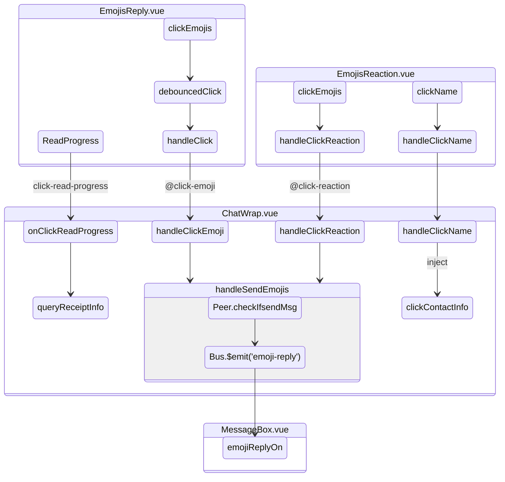

# 消息块

## 消息类型

| 文件名称          | 位置               | 命名规则 | 描述     |
| ----------------- | ------------------ | -------- | -------- |
| CallRecordChat    | C\Chat\            |          | 通话     |
| VoiceChat         | C\Chat\VoiceChat\  |          | 语言     |
| VoiceTxtChat      | C\Chat\            |          | 视频     |
| PictureChat       | C\Chat\            |          | 图片     |
| NameCard          | C\Chat\            |          | 名片     |
| MessageTxtChat    | C\Chat\            |          | 文字     |
| MeetingInviteChat | C\Chat\            |          | 会议邀请 |
| MeetingCard       | C\Chat\            |          | 会议卡片 |
| E2EDescript       | C\Chat\            |          | e2e 加密 |
| DocumentChat      | C\Chat\            |          | 文本     |
| MessageFileBox    | C\kits\            |          | 文件     |

# 表情回复

## 表情按钮 EmojisReply.vue

### 已读未读

### 表情列表

## 展示 EmojisReaction.vue

> emojiTags 表情数据源

> clickContactInfo 查看个人卡片

> handleClickReaction 点击表情

黑名单错误警告、断网提示

