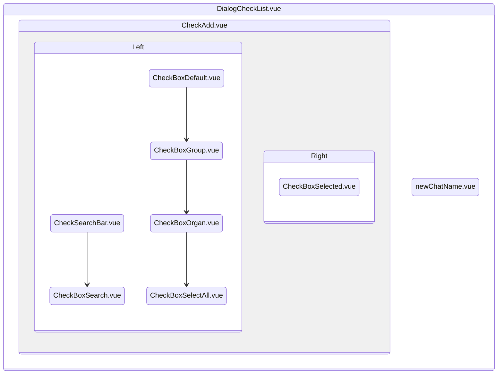
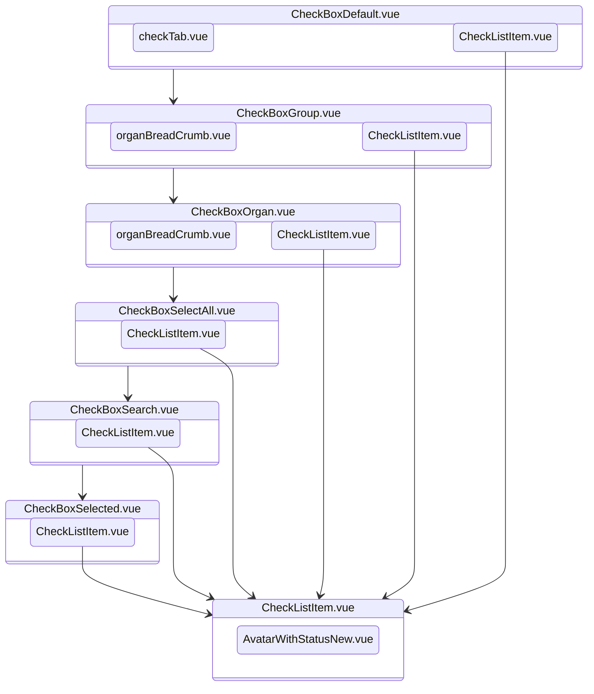
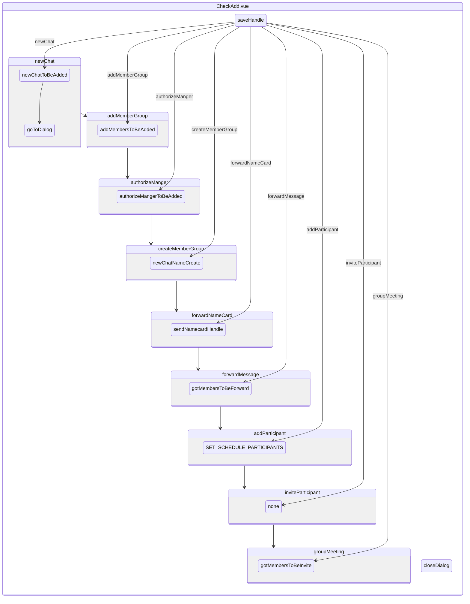

# 组织架构

## 组织架构联系人列表

## 人员选中弹窗

| 文件名称            | 位置     | 命名规则 | 描述             |
| ------------------- | -------- | -------- | ---------------- |
| DialogCheckList     | /        |          | 人员选择弹窗顶层 |
| CheckAdd            | /        |          | 人员选择弹窗     |
| newChatName         | /        |          | 群名称输入       |
| CheckSearchBar      | /        |          | 搜索栏           |
| CheckBoxSearch      | /        |          | 搜索内容         |
| CheckBoxDefault     | /        |          | 默认内容         |
| CheckBoxGroup       | /        |          | 群组列表         |
| CheckBoxOrgan       | /        |          | 组织架构列表     |
| CheckBoxSelectAll   | /        |          | 已被选择列表     |
| CheckBoxSelected    | /        |          | 已选择内容       |
| CheckListItem       | /        |          | 列表模块         |
| organBreadCrumb     | contacts |          | 面包屑           |
| checkTab            | /        |          | 切换栏           |
| AvatarWithStatusNew | /        |          | 头像             |

### DialogCheckList

| 文件名称          | 描述         |
| ----------------- | ------------ |
| newChat           | 新建会话     |
| addMemberGroup    | 添加群成员   |
| authorizeManger   | 授权管理     |
| createMemberGroup | 创建群组     |
| forwardNameCard   | 发送名片     |
| forwardMessage    | 转发消息     |
| addParticipant    | 添加会议成员 |
| inviteParticipant | 会议邀请     |
| groupMeeting      | 群会议通话   |

| 文件名称            | 默认值 | 可以选项                          | 描述                 |
| ------------------- | ------ | --------------------------------- | -------------------- |
| checkedNum          | 0      | 0/1/5                             | 可选人数             |
| showCancel          | true   | false/true                        | 是否展示 Cancel 按钮 |
| label               | ''     |                                   | Create 按钮名称      |
| tabTypeName         | ''     |                                   | Tab 默认内容         |
| memberType          | user   |                                   | 数据源类型           |
| channels            |        | []                                |                      |
| checkedMembers      |        | []                                | 已选人员             |
| DialogType          | none   | newChat..                         | 弹窗类型             |
| getCurrentSpaceType | false  | false/true                        | 是否个人空间类型     |
| isDialog            | true,  |                                   | 是否显示选人弹窗     |
| createChannelHide   | false, |                                   | 是否显示新建会话弹窗 |
| createChannelName   | '',    |                                   | 新建会议名称缓存     |
| newChatNameHide     | false, |                                   | 创建群组是否显示     |
| newChatCacheMembers | [],    |                                   | 选人缓存数据         |
| participants        | [],    |                                   | 新建会议已选缓存     |
| currentHid          | '',    |                                   | 群会议 Hid           |
| channelMeetingVideo | false  | 群组会议类型 false 语音 true 视频 | 群新建会议类型       |

| 文件名称          | 首页      | tab   | 可选人数 | 数据源     | 已选内容 | 部门可选 |
| ----------------- | --------- | ----- | -------- | ---------- | -------- | -------- |
| newChat           | organ     | X     | X        | user       | X        | Y        |
| addMemberGroup    | X         | organ | X        | user       | Y        | Y        |
| authorizeManger   | X         | organ | 5        | user       | Y        | X        |
| createMemberGroup | X         | organ | X        | user       | X        | Y        |
| forwardNameCard   | X         | organ | 1        | user       | X        | X        |
| forwardMessage    | X         | all   | 5        | user group | X        | X        |
| addParticipant    | X         | all   | X        | user       | Y        | Y        |
| inviteParticipant | X         | all   | X        | user       | Y        | Y        |
| groupMeeting      | selectAll | X     | X        | GroupUser  | Y        |          |
| P 空间            | X         | X     | X        | user       | X        |          |
| newChat           | X         | X     | X        | user       | X        |          |
| addMemberGroup    | X         | X     | X        | user       | Y        |          |
| authorizeManger   | X         | X     | 5        | user       | Y        |          |
| createMemberGroup | X         | X     | X        | user       | X        |          |
| forwardNameCard   | X         | X     | 1        | user       | X        |          |
| forwardMessage    | X         | X     | 5        | user group | X        |          |
| addParticipant    | X         | X     | X        | user       | Y        |          |
| inviteParticipant | X         | X     | X        | user       | Y        |          |
| groupMeeting      | selectAll | X     | X        | GroupUser  | Y        |          |

### CheckAdd

iniChannels

changeOrganId

closeTab

toCheckTabHandle

CreateBtn

clearSelect

clearSearchAndBack
handleKeyDown
handleKeyUp
itemCheckAll

itemCheck
formatePeerList
async getSelectAllData

async getOrganData
async getPeerInfo

async updatePeersInfo
async getGroupData
async SearchListPeer
async SearchListOrgan
async fetchSearchPeerList
searchHandle
async readMoreSearch
resetData

resetSearchData
getWhiteList
async contactsScroll
async readMembersToBeAdded
async getAttendeeList
getMeetingParticipants

handleItemState
updateContactData
