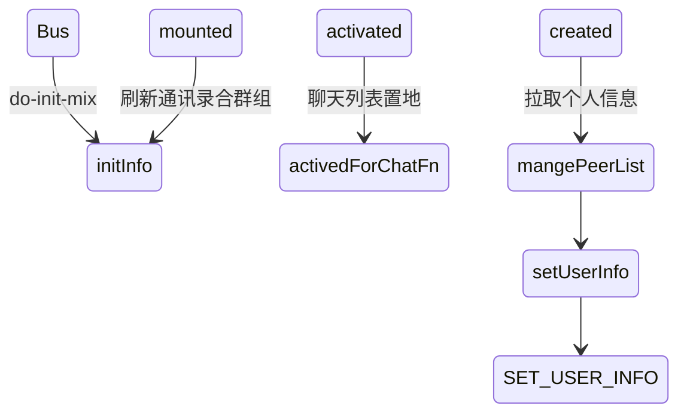
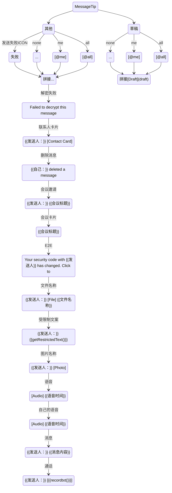
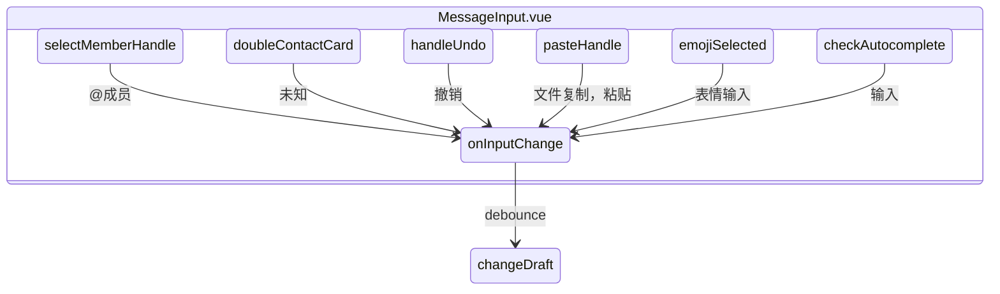
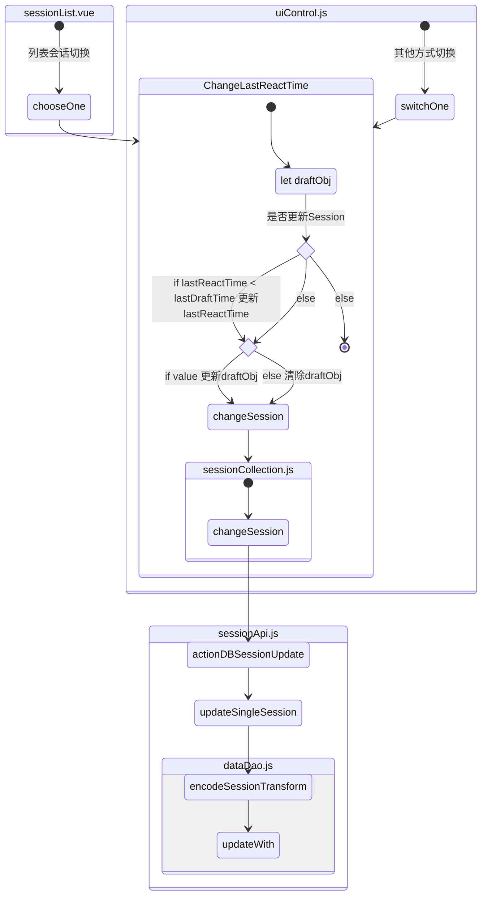
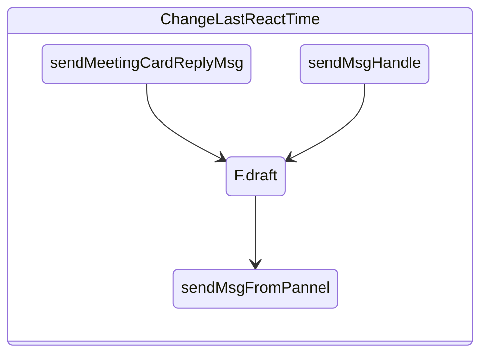

---
tag:
  - 草稿
  - 消息提示
  - 未读数
---

# ChatsPanel



初始化 UserInfo

```
Main
	ChatsPanel
		SessionList
		MessageBox
```

# 消息提示

1. 消息列表中，当有@我消息时，显示[@me],当有@all 消息时，显示[@all]
1.



# 草稿

## 流程

1. 草稿实时节流缓存，接收到消息清除缓存
1. 切换会话，检测更新会话
1. 发送（会议卡片、消息）清除缓存
1. 漏洞：编辑草稿的时间早于操作时间（拉取成员）
1. 监听到草稿，更新数据库（value 和 time），切换时候才判断是否需要更新列表时间戳（时间是否 lastReactTime 大于）
1. 处于当前会话不展示草稿

> 输入框-防抖更新草稿



> 切换聊天列表



> 发送消息清除草稿


