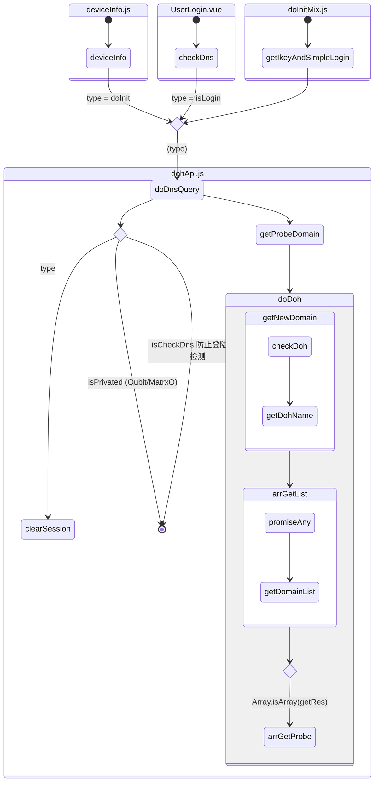

# DOH 机房检测



| API                   | 参数 | 描述       | 描述             |
| --------------------- | ---- | ---------- | ---------------- |
| /dns-query            | Get  | name、date |                  |
| /domain/get           | Get  |            |                  |
| /api/idc/probe_domain | Get  |            | 检查 host 有效性 |

## doDnsQuery

```js
/**
 * @description 根路由检测
 * @param {string} type 检测类型
 */
```

## clearSession

```js
/**
 * @description 清除本地检测类型
 * 60s节流
 */
```

## getProbeDomain

```js
/**
 * @description 域名检测API 检查host有效性
 * @param {string} url 域名地址
 */

`probe_domain`API请求报错，都会执行 `doDoh`
```

## doDoh

```js
/**
 * @description 组装 DNS 探测请求
 * @param {object} originMessage 消息
 */
```

## getNewDomain

```js
/**
 * @description 选择DOH地址请求域名解析A记录，也就是获得域名指向的IP
 * @param {object} originMessage 消息
 */
```

## checkDoh

```js
/**
 * @description 组装DNS探测请求
 * @param {object} data 消息
 */
```

## getDohName

```js
/**
 * @description 获取域名Host
 */
```

## arrGetList

```js
/**
 * @description 获取实际域名
 * @param {object} arr 消息
 */
```

## getDomainList

```js
/**
 * @description 如果某个DOH正常返回，则根据结果获得IP地址
 * @param {object} url 消息
 */
```

## arrGetProbe

```js
/**
 * @description probe_domain
 * @param {object} arr 消息
 */
```

## ~getNewSimpleIDC~

```js
/**
 * @description 新IDC
 * @param {string} hid id
 */
```

[接口相关](https://wiki.corp.matrx.team/pages/viewpage.action?pageId=20217884)
