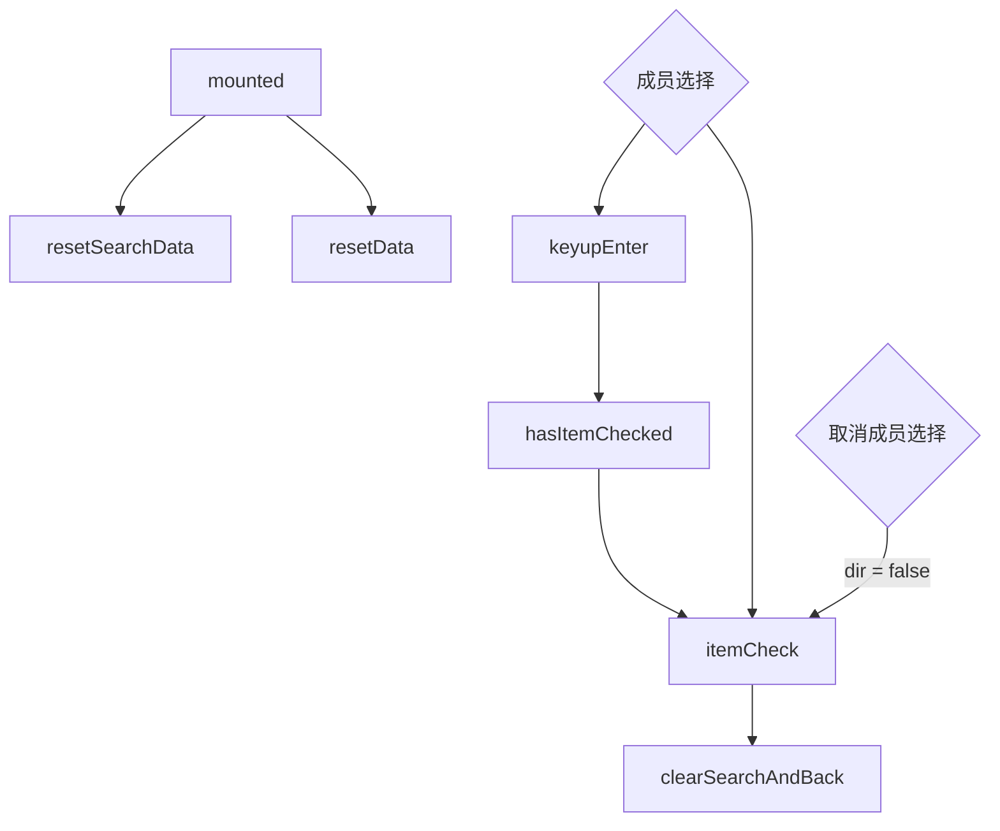
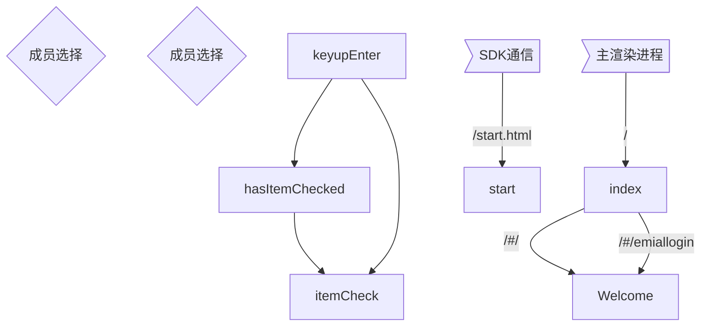

# 成员选择器

inviteBtn
keyupEnter
keyupPrevent
resetSearchData
searchHandle
isCheckMember
hasItemChecked
itemCheck
clearSearchAndBack
resetData
fetchSearchPeerList
getWhiteList
formatePeerList
readMembersToBeAdded
readMoreSearch
fetchMore
getMeetingParticipants
handleItemState
getAttendeeList
readMore
updateContactData
clearSelect

| props           | type    | default |        | 描述            |
| --------------- | ------- | ------- | ------ | --------------- |
| exclude         | Array   |         |        |                 |
| label           | String  | ''      |        | Create 名称     |
| cancelLabel     | String  | ''      |        | Cancel 名称     |
| isInvitation    | Boolean |         |        | 是否为邀请      |
| checkedMembers  | Array   | []      |        | 已选择列表      |
| canZero         | Boolean | false   |        | 是否禁用 Create |
| isMeetingDialog | Boolean | false   |        | 是否为会议弹窗  |
| showCancel      | Boolean |         |        | 是否显示 Cancel |
| theme           | String  |         | dark、 | 主题            |

| data           | type | default | 描述               |
| -------------- | ---- | ------- | ------------------ |
| instance       |      | ''      |                    |
| searchVal      |      | ''      | 搜索内容           |
| searchKeyupNum |      | ''      | 搜索内容切换 Index |
| tobeadded      |      | []      |                    |
| selected       |      | []      |                    |
| start          |      | 0       |                    |
| howmuch        |      | 30      |                    |
| isSipNumber    |      | false   |                    |
| filterList     |      | []      | 过滤列表           |
| loadedData     |      | false   | 数据加载中         |

| methods                | type     | default    |     | 描述                     |
| ---------------------- | -------- | ---------- | --- | ------------------------ |
| inviteBtn              |          |            |     | 触发 Create              |
| keyupEnter             |          |            |     | 输入框回车               |
| keyupPrevent           |          | type       |     | 输入框上下键             |
| resetSearchData        |          | isClearAll |     | 重置搜索数据             |
| searchHandle           | debounce |            |     | 搜索内容触发             |
| isCheckMember          |          | item       |     |                          |
| hasItemChecked         |          | item       |     |                          |
| itemCheck              |          | item       |     |                          |
|                        |          | dir        |     |                          |
|                        |          |            |     |                          |
| clearSearchAndBack     |          |            |     | 清除搜索过程中选中的内容 |
| resetData              |          |            |     |                          |
| fetchSearchPeerList    | async    | start      |     |                          |
|                        |          | howmuch    |     |                          |
|                        |          | spaceId    |     |                          |
| getWhiteList           |          |            |     |                          |
| formatePeerList        |          | peers      |     |                          |
| readMembersToBeAdded   | async    | start      |     |                          |
|                        |          | howmuch    |     |                          |
| readMoreSearch         | async    |            |     |                          |
| fetchMore              | async    |            |     |                          |
| getMeetingParticipants |          |            |     |                          |
| handleItemState        |          |            |     |                          |
| getAttendeeList        | async    |            |     |                          |
| readMore               | debounce |            |     |                          |
| updateContactData      |          |            |     |                          |
| clearSelect            |          |            |     |                          |
