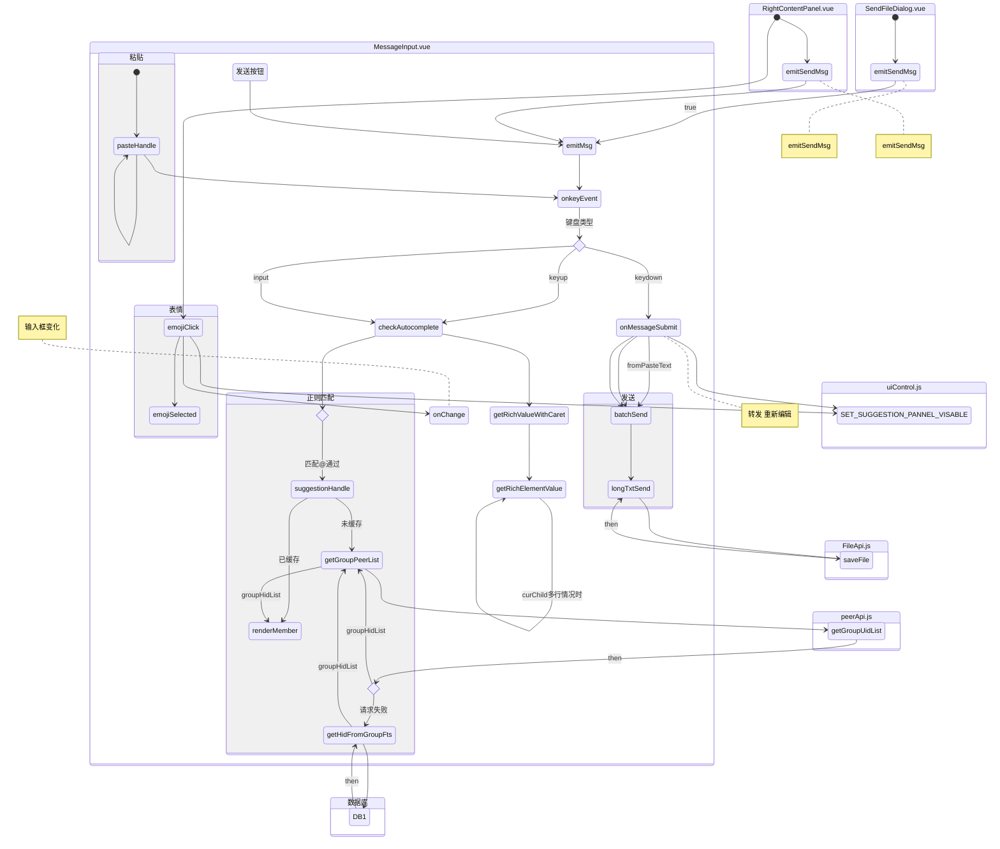
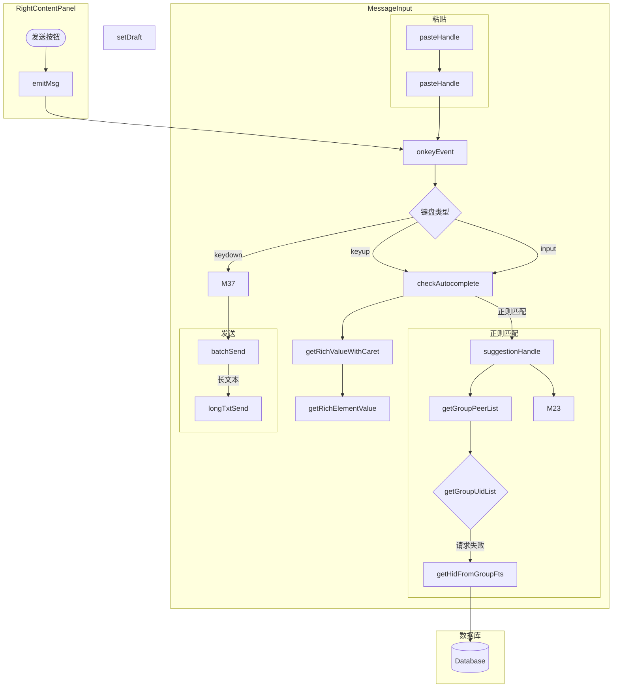

# 输入框 messageIput

## MessageInput

<!-- tabs:start -->

#### **components**

| components       | 描述             |
| ---------------- | ---------------- |
| SuggestionPannel | @成员列表        |
| Backtarget       | 消息查看快捷按钮 |
| EmojisPannel     | 表情             |

#### **props**

| props             | 描述             |
| ----------------- | ---------------- |
| peerId            | 聊天框 ID        |
| isForce           |                  |
| emojiIconRef      |                  |
| backTargetOptions |                  |
| isNeedSuggestion  | 是否需求成员列表 |

#### **data**

| data               | 描述                             |
| ------------------ | -------------------------------- |
| isFocus            | 编辑状态（默认：未选中）         |
| matchVal           | 模糊匹配 （@ 或 ：表情）         |
| reqIdList          | 匹配成员列表                     |
| inputValue         | 输入框内容                       |
| isBanned           | 是否被禁言                       |
| pos                | 光标位置                         |
| autoCompleteRegEx  | 规则                             |
| lastLength         |                                  |
| lastTyping         |                                  |
| keyupStarted       |                                  |
| selection          | 光标选中内容                     |
| previousQuery      | 正则匹配到的内容（未见实际使用） |
| wasEmpty           |                                  |
| selectedSuggeElmID |                                  |
| currentSelection   |                                  |
| selId              | @人的位置                        |
| minInputHeight     |                                  |
| maxInputHeight     |                                  |
| offsetGap          |                                  |
| auctoCompleteMatch |                                  |

#### **computed**

suggestionList 群成员缓存列表
uiControl

| computed                | 描述                      |
| ----------------------- | ------------------------- |
| actDialogId             | 监听聊天框 ID（清空缓存） |
| suggestionPannelVisable |                           |
| suggestionHid           | 缓存列表 ID               |
| memberList              | 缓存成员列表              |
| foundList               | 过滤后成员列表            |
| iWasBlocked             | 是否被拉黑                |

#### **methods**

| methods               | 描述                     | 描述              |
| --------------------- | ------------------------ | ----------------- |
| emojiClick            | 输入表情                 | F                 |
| emojiSelected         | 替换表情元素             | emojiClick        |
| handleUndo            | 撤回修改内容             |                   |
| setRichFocus          | 设置光标位置             |                   |
| restoreSelection      | 之前选中内容继续保持选中 |                   |
| clickInputWarp        | 点击输入框               |                   |
| rightClickWarp        | 右键菜单                 | 同时触发          |
| dbclick               | 右键菜单                 | 同时触发          |
| selectMemberHandle    | 添加 @成员               |                   |
| getEmojiHtml          | 表情内容初始化           |                   |
| getRichHtml           | 的所发生的               |                   |
| hideSuggestions       | 设置建议窗格可见         |                   |
| inputFocusHandle      | 输入框聚焦               |                   |
| inputBlurHandle       | 输入框失焦               |                   |
| onChange              | 输入框内容变化监听       |                   |
| onInputChange         | 同步输入框内容           |                   |
| checkInputHeight      | 修改输入框高度           |                   |
| getRichElementValue   | 的所发生的               |                   |
| checkAutocomplete     | 清空输入框触发           | checkAutocomplete |
| cleanRichTextarea     | 的所发生的               |                   |
| getRichValue          | 的所发生的               |                   |
| isMemberMath          | 群成员过滤               |                   |
| renderMember          | 渲染成员列表             |                   |
| suggestionHandle      | 的所发生的               | checkAutocomplete |
| getHidFromGroupFts    | 数据库获取群成员         |                   |
| getGroupPeerList      | 获取群成员               |                   |
| clearAllReq           | 清除缓存数据             |                   |
| focusHandle           | 聚焦输入框               |                   |
| showInlineSuggestions |                          | 未使用            |
| blurHandle            |                          | 未使用            |
| pasteHandle\_         | 触发粘贴                 |                   |
| pasteHandle           | 文件复制，粘贴           |                   |
| updateInputerHeight   | 更新输入框高度           |                   |
| isJsonString          | 是否为字符串             |                   |
| longTxtSend           | 长文本发送               |                   |
| batchSend             | 长度过滤                 | onMessageSubmit   |
| onMessageSubmit       | 转发 重新编辑            |                   |
| handleMetionKeyborad  | 的所发生的               |                   |
| onkeyEvent            | 键盘事件监听             |                   |
| messageSubmit         | 发送消息                 |                   |
| resetMessageInputer   | 重置输入框               |                   |
| setDraft              | 设置输入框内容           | F                 |
| emitMsg               | 触发发送按钮             | F                 |

<!-- tabs:end -->

M1[emojiClick]
M2[emojiSelected]
M3[handleUndo]
M4[setRichFocus]
M5[restoreSelection]
M6[clickInputWarp]
M7[rightClickWarp]
M8[dbclick]
M9[selectMemberHandle]
M10[getEmojiHtml]
M11[getRichHtml]
M12[hideSuggestions]
M13[inputFocusHandle]
M14[inputBlurHandle]
M15[onChange]
M16[onInputChange]
M17[checkInputHeight]

M20[cleanRichTextarea]
M21[getRichValue]
M22[isMemberMath]
M23[renderMember]

M27[clearAllReq]
M28[focusHandle]
M29[showInlineSuggestions]
M30[blurHandle]

M33[updateInputerHeight]
M34[isJsonString]

M37[onMessageSubmit]
M38[handleMetionKeyborad]
M39[onkeyEvent]
M40[messageSubmit]
M41[resetMessageInputer]



> 监听键盘输入（文本输入、表情输入、onTyping（未知））

```
@input="onkeyEvent($event)"
@compositionstart="onkeyEvent($event)"开始新的输入合成时会触发
@compositionupdate="onkeyEvent($event)"触发于字符被输入到一段文字的时候
@compositionend="onkeyEvent($event)"在输入中文或者语音等完毕或取消时

onkeyEvent
checkAutocomplete
getRichValueWithCaret
getRichElementValue
getRichElementValue
hideSuggestions
onInputChange
getRichValue
getRichElementValue
getRichElementValue
checkInputHeight
```

> 快捷键粘贴

```
pasteHandle_
pasteHandle
isJsonString
onkeyEvent
checkAutocomplete
getRichValueWithCaret
getRichElementValue（循环触发）
```

> 菜单粘贴

```
clickInputWarp
dbclick
rightClickWarp
pasteHandle_
pasteHandle
isJsonString
onkeyEvent
checkAutocomplete
getRichValueWithCaret
getRichElementValue（循环触发）
```

> 某人

```

onkeyEvent
checkAutocomplete
getRichValueWithCaret
getRichElementValue
getRichElementValue
onInputChange
getRichValue
getRichElementValue
getRichElementValue
checkInputHeight
suggestionHandle
getGroupPeerList
isMemberMath（循环触发）
。。。。renderMember
isMemberMath（循环触发）
clearAllReq
inputBlurHandle
```

### suggestionHandle

vuex 缓存群成员，缓存了直接渲染，未缓存拉取最新群成员。

> autoCompleteRegEx（需要屏蔽非群聊， 垃圾调用）

`/(\S|^|\s)(:|@)([\S]*)$/`匹配分为三部分`起始或有空格、没有空格`, `匹配@或：`, `没有空格`结束
`/(^|\s|[?!\@|\S])(:|@)([\S]*)$/`匹配分为三部分`起始或有空格、没有空格或者不等于@`, `匹配@或：`, `没有空格`结束

(%3A%7C%40)(%5B%5CS%5D*)%24>)

SearchIndexManager

未使用记录
EmojiHelper.getPopularEmoj

### suggestionList 群成员缓存

memberList 群成员列表
foundList 模糊搜索群成员列表（供 SuggestionPannel 使用）
suggestionHid 群缓存 Id

initState 切换空间清除缓存
ADD_MEMBER_LIST 添加缓存群成员列表
SET_MEMBER_LIST 清空缓存群成员列表
SET_FOUND_LIST 设置模糊搜索群成员列表
SET_SUGGESTION_HID 设置群缓存 Id

### getGroupPeerList

获取群成员列表，每次匹配到 @模糊匹配为空拉取一次最新数据。（此处设计逻辑紊乱，重复调用，需优化）

## CKMessageInput 优化版

优化版本

```
/**
 * 包含功能：
 * 文本： 识别链接 emoji 快捷键 @人 列表 复制粘贴
 * emoji: 插入和转换 最近输入 符合列表 smiley emoji
 * 状态：记住上次输入状态
 * 文件： 拖拽、多文件 文件上传定制 下载
 * 国际化：RTL 英语 阿拉伯语
 * 行内编辑模式
 * SKIN
 * toolBar
 * code
 * 其他格式的屏蔽 pasteFromWordRemoveStyles
 * enableContextMenu
 * 换行
 * 监听的事件 on:
 * metions
 * htmlEncodeOutput
 * forcePasteAsPlainText
 *
 * **/
```

### CKEDITOR 富文本编辑

import CKEDITOR from 'CKEDITOR'; 具有模块化架构的现代 JavaScript 富文本编辑器。其干净的 UI 和功能为创建语义内容提供了完美的 WYSIWYG UX ❤️。
