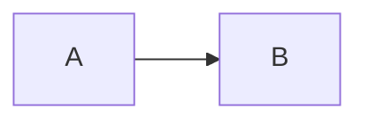
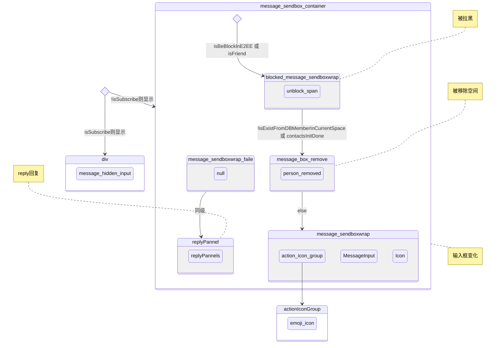
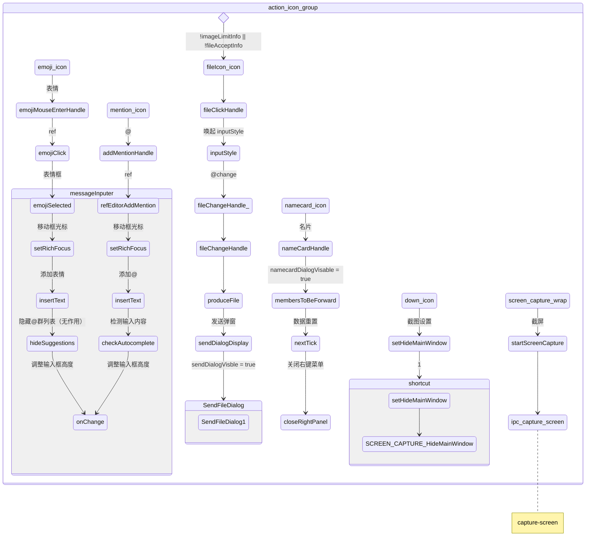

# 输入框

## 思维导图

<script>

</script>





<!-- tabs:start -->

<!-- tab:actionIconGroup -->



<!-- tab:Icon -->

Icon

<!-- tabs:end -->

## inputStyle 文件选择

```
<label for="upimfile" v-if="!imageLimitInfo || !fileAcceptInfo" class="chat_icon upimfile">按钮</label>
<input type="file" multiple="multiple" class="inputStyle" id="upimfile" name="upimfile" :accept="fileAcceptValue" @change="fileChangeHandle_" ref="fileInput">

<label for="peas">Do you like peas?</label>
<input type="file" name="peas" id="peas">
```
