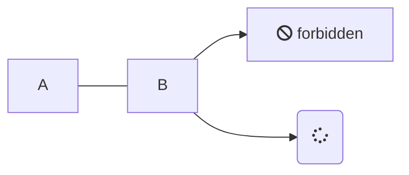

# IM

## 插件

### [accordion](https://github.com/isaozler/docsify-accordion '问题与答案折叠') 手风琴

```html
<!-- docsify-accordion -->
<link rel="stylesheet" href="//unpkg.com/docsify-accordion/src/style.css">
<script src="//unpkg.com/docsify-accordion/src/index.js"></script>
```


```md
// 语法
+(space) document (space)+
```

```md
> FAQ Section

Introduction text for the FAQ page.

+ Question 1? +

  Answer 1

+ Question 2? +

  Answer 2
```

> FAQ Section

Introduction text for the FAQ page.

+ Question 1? +

  Answer 1

+ Question 2? +

  Answer 2

### [Gitalk](https://github.com/gitalk/gitalk) 评论系统
一个现代化的，基于Preact和Github Issue的评论系统。

```html
<link rel="stylesheet" href="//cdn.jsdelivr.net/npm/gitalk/dist/gitalk.css">

<script src="//cdn.jsdelivr.net/npm/docsify/lib/plugins/gitalk.min.js"></script>
<script src="//cdn.jsdelivr.net/npm/gitalk/dist/gitalk.min.js"></script>
<script>
  const gitalk = new Gitalk({
    clientID: 'Github Application Client ID',
    clientSecret: 'Github Application Client Secret',
    repo: 'Github repo',
    owner: 'Github repo owner',
    admin: ['Github repo collaborators, only these guys can initialize github issues'],
    // facebook-like distraction free mode
    distractionFreeMode: false
  })
</script>
```
### [Disqus](https://disqus.com/) 评论系统

```html
<script>
  window.$docsify = {
    disqus: 'shortname'
  }
</script>
<script src="//cdn.jsdelivr.net/npm/docsify/lib/plugins/disqus.min.js"></script>
```

### [livere](https://github.com/TaQini/docsify-livere) 评论系统

### [valine](https://github.com/daidi/docsify-valine/) 评论系统

### [select](https://github.com/jthegedus/docsify-select) 选择框

> 安装
```html
<script>
  window.$docsify = {
    select: {
      detectOperatingSystem: {
        enabled: false,
        menuId: "operating-system"
      },
      sync: false,
      theme: "classic"
    },
  }
</script>

<script src="https://cdn.jsdelivr.net/npm/docsify-select@1"></script>
```

> 案例
```md
<!-- select:start -->
<!-- select-menu-labels: Operating System -->
Common content can go here above the first heading in a section and be rendered for all selections!
#### --macOS--
macOS instructions here
#### --Linux--
Linux instructions here
<!-- select:end -->
```

<!-- select:start -->
<!-- select-menu-labels: Operating System -->
Common content can go here above the first heading in a section and be rendered for all selections!
#### --macOS--
macOS instructions here
#### --Linux--
Linux instructions here
<!-- select:end -->

```md
<!-- select:start -->
<!-- select-menu-labels: Operating System,Installation Method -->
### --macOS,Git--
macOS + Git
### --macOS,Homebrew--
macOS + Homebrew
### --Linux,Git--
Linux + Git
<!-- select:end -->
```

<!-- select:start -->
<!-- select-menu-labels: Operating System,Installation Method -->
### --macOS,Git--
macOS + Git
### --macOS,Homebrew--
macOS + Homebrew
### --Linux,Git--
Linux + Git
<!-- select:end -->


### 谷歌统计 - Google Analytics

> 需要配置 track id 才能使用。

```html
<script>
  window.$docsify = {
    ga: 'UA-XXXXX-Y'
  }
</script>
<script src="//cdn.jsdelivr.net/npm/docsify/lib/docsify.min.js"></script>
<script src="//cdn.jsdelivr.net/npm/docsify/lib/plugins/ga.min.js"></script>
```

> 也可以通过 `data-ga` 配置 id。

```html
<script src="//cdn.jsdelivr.net/npm/docsify/lib/docsify.min.js" data-ga="UA-XXXXX-Y"></script>
<script src="//cdn.jsdelivr.net/npm/docsify/lib/plugins/ga.min.js"></script>
```

### [mermaid](https://github.com/Leward/mermaid-docsify) 流程图


```html
<script src="//unpkg.com/mermaid/dist/mermaid.js"></script>
<script src="//unpkg.com/docsify-mermaid@latest/dist/docsify-mermaid.js"></script>
<script>mermaid.initialize({ startOnLoad: true });</script>
```




### [puml](https://github.com/indieatom/docsify-puml) 流程图

### [kroki](https://github.com/zuisong/docsify-kroki) 流程图

### [nomnoml](https://github.com/mylesj/docsify-nomnoml) SVG流程图

### [charty](https://github.com/markbattistella/docsify-charty) 图表

### [websequencediagrams](https://github.com/aajiwani/websequencediagrams-docsify) 选择框

### [carbon](https://github.com/waruqi/docsify-plugin-carbon) 自动构建工具

### [changelog-plugin](https://github.com/Plugin-contrib/docsify-plugin/tree/master/packages/docsify-changelog-plugin) 更新记录

### [wikilink](https://github.com/zpengg/docsify-wikilink) 快捷链接

### [link-preview](https://github.com/puria/docsify-link-preview) 链接预览

### [pangu](https://github.com/sy-records/docsify-pangu) 语音之间空格

### [material-icons](https://github.com/erickjx/docsify-material-icons) 图标

### [fontawesome](https://github.com/erickjx/docsify-fontawesome) 图标

### [twemoji](https://github.com/TaQini/docsify-twemoji) emoji

### emoji

默认是提供 emoji 解析的，能将类似 `:100:` 解析成 :100:。但是它不是精准的，因为没有处理非 emoji 的字符串。如果你需要正确解析 emoji 字符串，你可以引入这个插件。

```html
<script src="//cdn.jsdelivr.net/npm/docsify/lib/plugins/emoji.min.js"></script>
```

?> 如果你不想解析成表情符号，可以使用__colon_<span>_</span>或`&#58;`。如果你需要在标题中使用，我们建议使用`&#58;`。例如，`&#58;100:`。

### [pdf-embed](https://github.com/lazypanda10117/docsify-pdf-embed) PDF文件

### [pdf-converter](https://github.com/meff34/docsify-to-pdf-converter) PDF文件

### [gltfexplorer](https://github.com/X-Ryl669/docsify-gltfexplorer) GLTF文件

### [gifcontrol](https://github.com/gbodigital/docsify-gifcontrol) gif文件

### [docsifyPhaser](https://github.com/luisalvesmartins/docsifyPhaser) Phaser代码

### [example-panels](https://github.com/VagnerDomingues/docsify-example-panels) 标签卡

### [tabs](https://jhildenbiddle.github.io/docsify-tabs) 标签卡

> 安装
```html
<script>
  window.$docsify = {
    tabs: {
      sync: false,
      theme: "classic",
    },
  }
</script>

<script src="https://cdn.jsdelivr.net/npm/docsify-tabs@1"></script>
```

> 案例

<!-- tabs:start -->
#### **md**
```md
<!-- tabs:start -->
#### **md**
Hello!
#### **French**
Bonjour!
#### **Italian**
Ciao!
<!-- tabs:end -->
```
#### **French**
Bonjour!
#### **Italian**
Ciao!
<!-- tabs:end -->

### [iframe](https://github.com/HerbertHe/docsify-codeblock-iframe) iframe

### [katex](https://github.com/upupming/docsify-katex) 数学公式

### [pseudocode](https://github.com/h-hg/docsify-pseudocode) 数学公式

### [flexible-alerts](https://github.com/fzankl/docsify-plugin-flexible-alerts) Note

### [corner](https://github.com/Koooooo-7/docsify-corner) 右上角图标

### [autoHeaders](https://github.com/markbattistella/docsify-autoHeaders) 自动给标题排序

### [footer-enh](https://github.com/erickjx/docsify-footer-enh) 页脚

### [sidebarFooter](https://github.com/markbattistella/docsify-sidebarFooter) 页脚

### [footer](https://github.com/Sujaykumarh/docsify-plugin-footer) 页脚

### [example-panels](https://github.com/VagnerDomingues/docsify-example-panels) 示例面板

### [progress](https://github.com/HerbertHe/docsify-progress) 进度条

### [code-inline](https://github.com/rakutentech/esquisite/tree/main/packages/docsify-code-inline#readme) 语法高亮

### [glossary](https://github.com/TheGreenToaster/docsify-glossary) 选择框

### [commento](https://github.com/ndom91/docsify-commento) 选择框

### [demo](https://github.com/JacobWeinbren/docsify-demo) demo案例

### [sidebar-collapse](https://github.com/iPeng6/docsify-sidebar-collapse) sidebar

### [slides](https://github.com/shawntabrizi/docsify-slides) 两列布局

### [toc](https://github.com/mrpotatoes/docsify-toc) 目录跳转

### [demo-vue](https://github.com/njleonzhang/docsify-demo-box-vue) 即时预览

### [demo-react](https://github.com/njleonzhang/docsify-demo-box-react) 即时预览
通过这个插件，示例代码可以在页面上即时呈现，让读者可以立即看到预览。当读者展开演示框时，源码和说明就会显示在那里，如果点击`Try in Jsfiddle`按钮，`jsfiddle.net`就会打开这个例子的代码，让读者自己修改代码和测试。

docsify同时支持[Vue](https://njleonzhang.github.io/docsify-demo-box-vue/)和[React](https://njleonzhang.github.io/docsify-demo-box-react/)版本的插件。

### [vue-data-tables](https://github.com/njleonzhang/vue-data-tables) 列表

### [edit-on-github](https://github.com/njleonzhang/docsify-edit-on-github) Github上编辑

### [plantuml](https://github.com/imyelo/docsify-plantuml) 选择框

### [remote-markdown](https://github.com/JerryC8080/docsify-remote-markdown) 远程MD

### [count](https://github.com/827652549/docsify-count) 字数统计
它提供了统计中文汉字和英文单词的功能，并且排除了一些markdown语法的特殊字符例如*、-等

**Add JS**
```html
<script src="//unpkg.com/docsify-count/dist/countable.js"></script>
```

**Add settings**
```js
window.$docsify = {
  count:{
    countable:true,
    fontsize:'0.9em',
    color:'rgb(90,90,90)',
    language:'chinese'
  }
}
```

### [pagination](https://github.com/imyelo/docsify-pagination) 章节切换

```html
<!-- pagination -->
<script src="//cdn.jsdelivr.net/npm/docsify-pagination/dist/docsify-pagination.min.js"></script>
```

### [copy-code/](https://github.com/jperasmus/docsify-copy-code/) 复制到剪贴板

```html
<!-- copy-code -->
<script src="//cdn.jsdelivr.net/npm/docsify-copy-code/dist/docsify-copy-code.min.js"></script>
```


### [123123](123123) 选择框


### [123123](123123) 选择框


```js
```


### 全文搜索 - Search

全文搜索插件会根据当前页面上的超链接获取文档内容，在 `localStorage` 内建立文档索引。默认过期时间为一天，当然我们可以自己指定需要缓存的文件列表或者配置过期时间。

```html
<script>
  window.$docsify = {
    search: 'auto', // 默认值

    search : [
      '/',            // => /README.md
      '/guide',       // => /guide.md
      '/get-started', // => /get-started.md
      '/zh-cn/',      // => /zh-cn/README.md
    ],

    // 完整配置参数
    search: {
      maxAge: 86400000, // 过期时间，单位毫秒，默认一天
      paths: [], // or 'auto'
      placeholder: 'Type to search',

      // 支持本地化
      placeholder: {
        '/zh-cn/': '搜索',
        '/': 'Type to search'
      },

      noData: 'No Results!',

      // 支持本地化
      noData: {
        '/zh-cn/': '找不到结果',
        '/': 'No Results'
      },

      // 搜索标题的最大层级, 1 - 6
      depth: 2,

      hideOtherSidebarContent: false, // 是否隐藏其他侧边栏内容

      // 避免搜索索引冲突
      // 同一域下的多个网站之间
      namespace: 'website-1',

      // 使用不同的索引作为路径前缀（namespaces）
      // 注意：仅适用于 paths: 'auto' 模式
      //
      // 初始化索引时，我们从侧边栏查找第一个路径
      // 如果它与列表中的前缀匹配，我们将切换到相应的索引
      pathNamespaces: ['/zh-cn', '/ru-ru', '/ru-ru/v1'],

      // 您可以提供一个正则表达式来匹配前缀。在这种情况下，
      // 匹配到的字符串将被用来识别索引
      pathNamespaces: /^(\/(zh-cn|ru-ru))?(\/(v1|v2))?/
    }
  }
</script>
<script src="//cdn.jsdelivr.net/npm/docsify/lib/docsify.min.js"></script>
<script src="//cdn.jsdelivr.net/npm/docsify/lib/plugins/search.min.js"></script>
```

当执行全文搜索时，该插件会忽略双音符（例如，"cafe" 也会匹配 "café"）。像 IE11 这样的旧版浏览器需要使用以下 [String.normalize()](https://developer.mozilla.org/en-US/docs/Web/JavaScript/Reference/Global_Objects/String/normalize) polyfill 来忽略双音符：

```html
<script src="//polyfill.io/v3/polyfill.min.js?features=String.prototype.normalize"></script>
```

### 外链脚本 - External Script
### [123123](123123) 选择框


如果文档里的 script 是内联脚本，可以直接执行；而如果是外链脚本（即 js 文件内容由 `src` 属性引入），则需要使用此插件。

```html
<script src="//cdn.jsdelivr.net/npm/docsify/lib/plugins/external-script.min.js"></script>
```

### [medium-zoom](https://github.com/francoischalifour/medium-zoom) 图片缩放

```html
<script src="//cdn.jsdelivr.net/npm/docsify/lib/plugins/zoom-image.min.js"></script>
```

忽略某张图片

```markdown

```

### [ethicalads](https://github.com/davidcralph/docsify-ethicalads) 广告位

### [codefund](https://github.com/njleonzhang/docsify-plugin-codefund) 广告位

```html
<!-- codefund -->
<script src="https://unpkg.com/docsify-plugin-codefund/index.js"></script>

<script>
  window.$docsify = {
    plugins: [
      DocsifyCodefund.create('51d43327-eea3-4e27-bd44-e075e67a84fb') // 把这个id改成你的codefund id
    ]
  }

  window.$docsify = {
    coverpage: true,
    name: 'vue-data-tables',
    repo: 'https://github.com/njleonzhang/vue-data-tables',
    subMaxLevel: 2,
    loadSidebar: true,
    disqus: 'vueDataTables',
    search: 'auto', // default

    plugins: [
      DocsifyCodefund.create(15) // change to your CodeFund property id
    ]
  }
</script>
```


### 更多插件
### [123123](123123) 选择框


参考 [awesome-docsify](awesome?id=plugins)

## Theme 主题

目前提供三套主题可供选择，模仿 [Vue](//vuejs.org) 和 [buble](//buble.surge.sh) 官网订制的主题样式。还有 [@liril-net](https://github.com/liril-net) 贡献的黑色风格的主题。

```html
<link rel="stylesheet" href="//cdn.jsdelivr.net/npm/docsify/themes/vue.css">
<link rel="stylesheet" href="//cdn.jsdelivr.net/npm/docsify/themes/buble.css">
<link rel="stylesheet" href="//cdn.jsdelivr.net/npm/docsify/themes/dark.css">
<link rel="stylesheet" href="//cdn.jsdelivr.net/npm/docsify/themes/pure.css">
<link rel="stylesheet" href="//cdn.jsdelivr.net/npm/docsify/themes/dolphin.css">
```

!> CSS 的压缩文件位于 `/lib/themes/`

```html
<!-- compressed -->

<link rel="stylesheet" href="//cdn.jsdelivr.net/npm/docsify/lib/themes/vue.css">
<link rel="stylesheet" href="//cdn.jsdelivr.net/npm/docsify/lib/themes/buble.css">
<link rel="stylesheet" href="//cdn.jsdelivr.net/npm/docsify/lib/themes/dark.css">
<link rel="stylesheet" href="//cdn.jsdelivr.net/npm/docsify/lib/themes/pure.css">
<link rel="stylesheet" href="//cdn.jsdelivr.net/npm/docsify/lib/themes/dolphin.css">
```

如果你有其他想法或者想开发别的主题，欢迎提 [PR](https://github.com/docsifyjs/docsify/pulls)。

### [themeable](https://jhildenbiddle.github.io/docsify-themeable/#/)

### 点击切换主题


<div class="demo-theme-preview">
  <a data-theme="vue">vue.css</a>
  <a data-theme="buble">buble.css</a>
  <a data-theme="dark">dark.css</a>
  <a data-theme="pure">pure.css</a>
  <a data-theme="dolphin">dolphin.css</a>
</div>


<style>
  .demo-theme-preview a {
    padding-right: 10px;
  }

  .demo-theme-preview a:hover {
    cursor: pointer;
    text-decoration: underline;
  }
</style>

<script>
  var preview = Docsify.dom.find('.demo-theme-preview');
  var themes = Docsify.dom.findAll('[rel="stylesheet"]');

  preview.onclick = function (e) {
    var title = e.target.getAttribute('data-theme')

    themes.forEach(function (theme) {
      theme.disabled = theme.title !== title
    });
  };
</script>

### [dark-mode](https://github.com/Plugin-contrib/docsify-plugin/tree/master/packages/docsify-dark-mode) 主题切换

### [darklight-theme](https://github.com/boopathikumar018/docsify-darklight-theme) 主题切换

```html
<link rel="stylesheet" href="//cdn.jsdelivr.net/npm/docsify-darklight-theme@latest/dist/style.min.css" title="docsify-darklight-theme" type="text/css"/>
<script src="//cdn.jsdelivr.net/npm/docsify-darklight-theme@latest/dist/index.min.js"></script>
```

```js
darklightTheme: {
  siteFont : "PT Sans",
  defaultTheme : 'dark',
  codeFontFamily : 'Roboto Mono, Monaco, courier, monospace',
  bodyFontSize : '17px',
  dark: {
    accent: '#42b983',
    toogleBackground : '#ffffff',
    background: '#091a28',
    textColor: '#c0c0c0',
    codeTextColor : '#00bc8c',
    codeBackgroundColor : '#0e2233',
    borderColor : '#0d2538',
    blockQuoteColor : '#858585',
    highlightColor : '#d22778',
    sidebarSublink : '#b4b4b4',
    codeTypeColor : '#ffffff',
    coverBackground : 'linear-gradient(to left bottom, hsl(118, 100%, 85%) 0%,hsl(181, 100%, 85%) 100%)',
    toogleImage : 'url(https://cdn.jsdelivr.net/npm/docsify-darklight-theme@latest/icons/sun.svg)'
  },
  light: {
    accent: '#42b983',
    toogleBackground : '#091a28',
    background: '#ffffff',
    textColor: '#34495e',
    codeTextColor : '#525252',
    codeBackgroundColor : '#f8f8f8',
    borderColor : 'rgba(0, 0, 0, 0.07)',
    blockQuoteColor : '#858585',
    highlightColor : '#d22778',
    sidebarSublink : '#b4b4b4',
    codeTypeColor : '#091a28',
    coverBackground : 'linear-gradient(to left bottom, hsl(118, 100%, 85%) 0%,hsl(181, 100%, 85%) 100%)',
    toogleImage : 'url(https://cdn.jsdelivr.net/npm/docsify-darklight-theme@latest/icons/moon.svg)'
  }
},
```

### [darklight](https://docsify-darklight-theme.boopathikumar.me/#/) 主题切换


```js
```