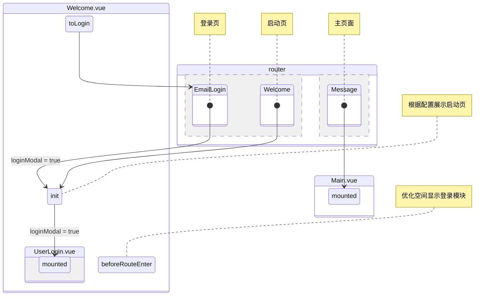

## index

index

## start

start

## sso

sso

## toast

toast

## callfeedback

callfeedback

## deleteAccountFeedback

deleteAccountFeedback

## meetingPwd

meetingPwd

## meetingInfo

meetingInfo

## meetingInvite

meetingInvite

## screenshot

screenshot

## pictureViewer

pictureViewer

## fileViewer

fileViewer

## Welcome

Welcome
