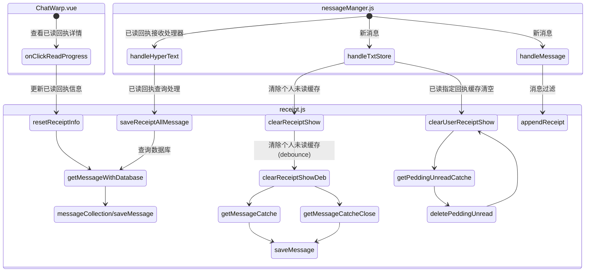
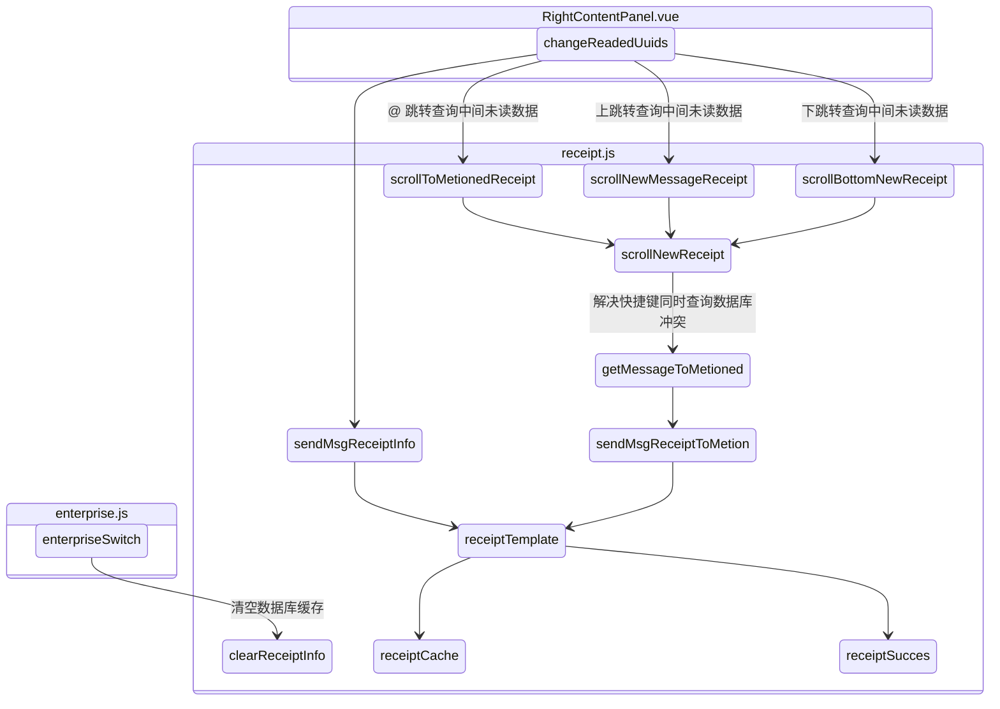
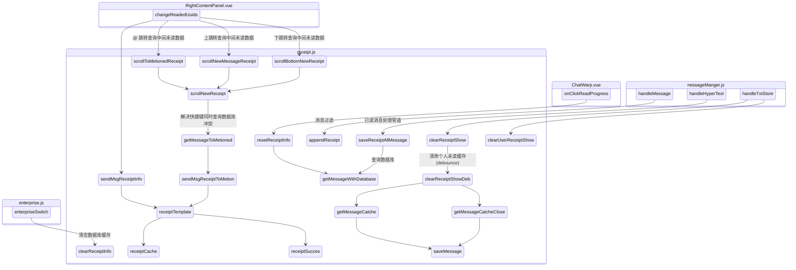

# 已读未读回执

数据查询合并 批量发送回执缓存 登录是触发回执清除

```mermaid
stateDiagram
  state nessageManger.js {
    [*] --> handleHyperText: 已读回执接收处理器
    [*] --> handleTxtStore: 新消息
    [*] --> handleMessage: 新消息
    handleHyperText --> saveReceiptAllMessage: 已读回执查询处理
    handleTxtStore --> clearReceiptShow: 清除个人未读缓存
    handleTxtStore --> clearUserReceiptShow: 已读指定回执缓存清空
    handleMessage --> appendReceipt: 消息过滤
  }
  state ChatWarp.vue {
    [*] --> onClickReadProgress: 查看已读回执详情
    onClickReadProgress --> resetReceiptInfo: 更新已读回执信息
  }
  state receipt.js {
    appendReceipt
    saveReceiptAllMessage --> getMessageWithDatabase: 查询数据库
    getMessageWithDatabase --> messageCollection/saveMessage
    clearUserReceiptShow --> getPeddingUnreadCatche
    getPeddingUnreadCatche --> deletePeddingUnread
    deletePeddingUnread --> clearUserReceiptShow
    clearReceiptShow --> clearReceiptShowDeb: 清除个人未读缓存(debounce)
    clearReceiptShowDeb --> getMessageCatche
    clearReceiptShowDeb --> getMessageCatcheClose
    getMessageCatche --> saveMessage
    getMessageCatcheClose --> saveMessage
    saveMessage
    resetReceiptInfo --> getMessageWithDatabase
  }
```

```mermaid
stateDiagram
  state enterprise.js {
    enterpriseSwitch --> clearReceiptInfo: 清空数据库缓存
  }
	state RightContentPanel.vue {
		changeReadedUuids --> sendMsgReceiptInfo
		changeReadedUuids --> scrollToMetionedReceipt:  @ 跳转查询中间未读数据
		changeReadedUuids --> scrollNewMessageReceipt: 上跳转查询中间未读数据
		changeReadedUuids --> scrollBottomNewReceipt: 下跳转查询中间未读数据
	}
  state receipt.js {
    clearReceiptInfo
    sendMsgReceiptInfo --> receiptTemplate
    receiptTemplate --> receiptCache
    receiptTemplate --> receiptSucces
    scrollToMetionedReceipt --> scrollNewReceipt
    scrollNewMessageReceipt --> scrollNewReceipt
    scrollBottomNewReceipt --> scrollNewReceipt
    scrollNewReceipt --> getMessageToMetioned: 解决快捷键同时查询数据库冲突
    getMessageToMetioned --> sendMsgReceiptToMetion
    sendMsgReceiptToMetion --> receiptTemplate
  }
```

```mermaid
stateDiagram
  state enterprise.js {
    enterpriseSwitch --> clearReceiptInfo: 清空数据库缓存
  }
  state ChatWarp.vue {
    onClickReadProgress --> resetReceiptInfo
  }
  state nessageManger.js {
    handleMessage --> appendReceipt: 消息过滤
    handleHyperText --> saveReceiptAllMessage: 已读消息处理管道
    handleTxtStore --> clearReceiptShow
    handleTxtStore --> clearUserReceiptShow
  }
	state RightContentPanel.vue {
		changeReadedUuids --> sendMsgReceiptInfo
		changeReadedUuids --> scrollToMetionedReceipt:  @ 跳转查询中间未读数据
		changeReadedUuids --> scrollNewMessageReceipt: 上跳转查询中间未读数据
		changeReadedUuids --> scrollBottomNewReceipt: 下跳转查询中间未读数据
	}
  state receipt.js {
    appendReceipt
    saveReceiptAllMessage --> getMessageWithDatabase: 查询数据库
    clearReceiptInfo
    clearUserReceiptShow
    sendMsgReceiptInfo --> receiptTemplate
    receiptTemplate --> receiptCache
    receiptTemplate --> receiptSucces
    scrollToMetionedReceipt --> scrollNewReceipt
    scrollNewMessageReceipt --> scrollNewReceipt
    scrollBottomNewReceipt --> scrollNewReceipt
    scrollNewReceipt --> getMessageToMetioned: 解决快捷键同时查询数据库冲突
    getMessageToMetioned --> sendMsgReceiptToMetion
    sendMsgReceiptToMetion --> receiptTemplate
    clearReceiptShow --> clearReceiptShowDeb: 清除个人未读缓存(debounce)
    clearReceiptShowDeb --> getMessageCatche
    clearReceiptShowDeb --> getMessageCatcheClose
    getMessageCatche --> saveMessage
    getMessageCatcheClose --> saveMessage
    saveMessage
    resetReceiptInfo --> getMessageWithDatabase
  }
```
