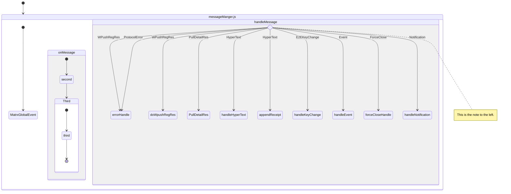
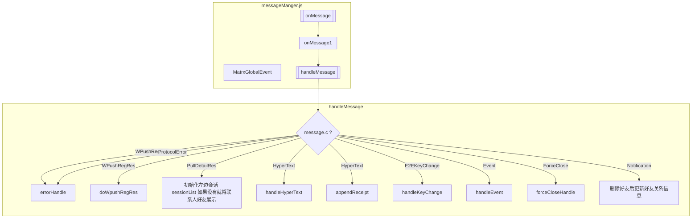

```mermaid
stateDiagram-v2
  State1: The state with a note
  note right of State1
    Important information! You can write
    notes.
  end note
  State1 --> State2
  note left of State2 : This is the note to the left.

  state if_state <<choice>>
    [*] --> IsPositive
    IsPositive --> if_state
    if_state --> False: if n < 0
    if_state --> True : if n >= 0

stateDiagram-v2
  [*] --> First

  state First {
    [*] --> Second

    state Second {
      [*] --> second
      second --> Third

      state Third {
        [*] --> third
        third --> [*]
      }
    }
  }
```



## 公共变量

| Function                | 类型 |              关联              | 废弃 |                     描述                     |
| ----------------------- | :--: | :----------------------------: | :--: | :------------------------------------------: |
| preventBlockMap         |      |                                |      |              消息 uuid 不能重复              |
| isKeyChangeListener     |      |                                |      | keychange 会被 on 多次导致发送多次 keychange |
| curTxtMsgUuid           |      |                                |      |              最后一条消息 UUID               |
| preMsg                  |      |         withdrawSingle         |      |             撤回消息的上一条消息             |
| osVersion               |      |         require('os')          |      |                   系统版本                   |
| loadingOfflineMsgStList |      |       offlineMsgLoading        |      |    离校消息 loading 效果 最多 10s 后隐藏     |
| pushRegTimer            |      | trySendWPushReg、handleMessage |      |                    延时器                    |
| atomrun                 |      |                                |      |                                              |
| e2eeLog                 |      |           messageLog           |      |                   E2E 日志                   |
| Message                 |      |                                |      |                     弹窗                     |
| noNeedSpaceIdCTypeList  |      |                                |      |            不需要空间 ID 消息类型            |
| msgType                 |      |                                |      |                 消息类型指针                 |
| messageATypeMap         |      |           checkAType           |      |                 无效通信类型                 |
| msgTypeInfo             |      |                                |      |                 消息类型名称                 |

> noNeedSpaceIdCTypeList

```
const noNeedSpaceIdCTypeList = ['ProtocolError', 'ForceClose', 'WPushRegRes'];
```

> msgType

```
const msgType = {
  HyperText: 'HyperText',
  Event: 'Event',
  'application/receipt': 'RECTIPT',
  'text/plain': 'TXT',
  'application/sticker': 'PICTURE',
  'image/jpeg': 'PICTURE',
  'image/webp': 'PICTURE',
  'image/jpg': 'PICTURE',
  'image/gif': 'PICTURE',
  'image/png': 'PICTURE',
  'image/bmp': 'PICTURE'
};
```

> messageATypeMap

```
// a: map 处理
const messageATypeMap = {
  1: 'APPID_EMBEDDED_NORMAL_PHONE',
  3: 'APPID_EMBEDDED_MAP_PHONE',
  4: 'APPID_EMBEDDED_DOODLE_PHONE',
  5: 'APPID_EMBEDDED_MESSAGE',
  6: 'APPID_EMBEDDED_CONTACT',
  7: 'APPID_EMBEDDED_VIDEO_PHONE',
  8: 'APPID_EMBEDDED_CARTOON_PHONE',
  9: 'APPID_EMBEDDED_SUBSCRIPTION',
  11: 'APPID_CHAT_HALL',
  13: 'APPID_PING_PONG'
};
```

> msgTypeInfo

```
export const msgTypeInfo = {
  HyperText: 'HyperText',
  Event: 'Event',
  'text/plain': 'TXT',
  'image/jpeg': 'Picture',
  'image/webp': 'Picture',
  'image/jpg': 'Picture',
  'image/gif': 'Picture',
  'image/png': 'Picture',
  'image/bmp': 'Picture',
  'audio/voice-msg': 'voice message',
  'text/vcard': 'Name Card',
  'meeting/invite': 'Meeting Invite',
  'text/richurl-x': 'Link',
  'text/richurl': 'Link',
  'x-filetransfer/octet-stream': 'File',
  'application/sticker': 'Emoji',
  'application/alarm': 'Calendar',
  'meeting/card': 'Meeting Card'
};
```

## 方法

| Function                  | 类型 | 默认值 | 废弃 |                                     描述                                      |
| ------------------------- | :--: | :----: | :--: | :---------------------------------------------------------------------------: |
| paths                     |      |        |      |                                                                               |
| isLinkExist               |      |        |      |                                 是否包含 url                                  |
| fileSafeMimeType          |      |        |      |                     处理文件消息 安全类型添加进度相关字段                     |
| addFileProcessFileds      |      |        |      |                             添加文件进度相关字段                              |
| getMsgType                |  EX  |        |      |                                 获取消息类型                                  |
| checkAType                |      |        |      |                               无效的 a 需要抛弃                               |
| retryE2EEPingAndScan      |      |        |      |                                                                               |
| e2EEPingAndSend           |      |        |      |                                                                               |
| retryE2EEScan             |      |        |      |                                                                               |
| e2eFailReScan             |      |        |      |                                                                               |
| e2eProcess                |      |        |      |                                                                               |
| historyIdFromTop          |      |        |      |                                                                               |
| reqCountFromHistory       |      |        |      |                                                                               |
| isHistory                 |      |        |      |                                                                               |
| isKeyChange               |      |        |      |                                                                               |
| addUnreadCount2           |      |        |      |                                                                               |
| subtractUnreadCount2      |      |        |      |                                                                               |
| messageNotification       |      |        |      |                                                                               |
| isEarlierLastTime         |      |        |      |                                                                               |
| dialogUnreadCount2        |      |        |      |                                                                               |
| updateDialogAndPeer2      |      |        |      |                                                                               |
| handleError               |      |        |      |                                                                               |
| fetchNoSendPingList       |      |        |      |                                                                               |
| reconnectSocketDoh        |      |        |      |                                                                               |
| sendKeyChangeFackMsg      |      |        |      |                                                                               |
| \_keychangeFn             |      |        |      |                                                                               |
| renameFileName            |      |        |      |                                                                               |
| ignoreWarnE2EESpaceMsg    |      |        |      |                                                                               |
| isIgnoreNotExistSpaceMsg  |      |        |      |                                                                               |
| preventBlockMsg           |      |        |      |                                                                               |
| onMessage                 |      |        |      |                                                                               |
| appendHistoryMessage      |      |        |      |                                                                               |
| sendWPushMsg              |      |        |      |                                                                               |
| trySendWPushReg           |      |        |      |                                                                               |
| offlineMsgLoading         |      |        |      |                                                                               |
| checkHWMeeting            |      |        |      |                                                                               |
| doWpushRegRes             |  EA  |        |      |                                                                               |
| initSessionAndShortMsg    |      |        |      |                                                                               |
| doPulldetail              |      |        |      |                                                                               |
| trySendPullDetail         |      |        |      |                                                                               |
| wrapSpaceId               |      |        |      |                                                                               |
| handleMessage             |  EA  |        |      |                                                                               |
| errorHandle               |      |        |      |                                                                               |
| handleKeyChange           |      |        |      |                                                                               |
| handleEvent               |      |        |      |                                                                               |
| matchRouter               |      |        |      |                                                                               |
| addSent                   |      |        |      |                                                                               |
| deleteContactRequest      |      |        |      |                                                                               |
| clearHistory              |      |        |      |                                                                               |
| changeProfileEditContacts |      |        |      |                                                                               |
| changeProfile             |      |        |      |                                                                               |
| muteLogic2                |      |        |      |                                                                               |
| muteGroupLogic            |      |        |      |                                                                               |
| readLogic2                |      |        |      |                                                                               |
| deleteLogic               |      |        |      |                                                                               |
| pinLogic                  |      |        |      |                                                                               |
| deleteContact             |      |        |      |                                                                               |
| aNewFriendComing          |      |        |      |                                                                               |
| accpeted                  |      |        |      |                                                                               |
| plainmessageprocess       |      |        |      |                                                                               |
| preprocess                |  EX  |        |      |                                   消息补全                                    |
| setEmojiReplyList         |      |        |      |                                                                               |
| saveMeetingCardMessage    |      |        |      |                                                                               |
| handleHyperText           |      |        |      |                                                                               |
| checkAndDeleteTempMsg     |      |        |      |                                                                               |
| enterpriseAdd             |      |        |      |                                                                               |
| enterpriseRemove          |      |        |      |                                                                               |
| handleNotification        |      |        |      |                                                                               |
| refreshBind               |      |        |      |                                                                               |
| handleTxtStore            |      |        |      |                                                                               |
| filterText                |      |        |      |                                                                               |
| wrapMessageNotify         |      |        |      |                               消息通知 数据构建                               |
| stopFileProcessAndDelete  |      |        |      |                        撤回消息时候需要暂停和删除文档                         |
| pinMsgHandle              |      |        |      | pin 消息：在被 pin 消息添加 pinUuid，关联到 pin 消息进而获取 stime pinname 等 |
| withdrawSingle            |      |        |      |                                 撤回单条消息                                  |

### handleMessage

| 消息类型 message.c | 类型 | 默认 描述                                              |
| ------------------ | :--: | :----------------------------------------------------- |
| WPushRegRes        |      | 若 state 不为 wpushres 不允许发送消息 会导致服务器问题 |
| PullDetailRes      |      | 初始化左边会话 sessionList 如果没有就将联系人好友展示  |
| HyperText          |      |                                                        |
| E2EKeyChange       |      |                                                        |
| Event              |      |                                                        |
| ProtocolError      |      |                                                        |
| ForceClose         |      |                                                        |
| Notification       |      | 删除好友后更新好友关系信息                             |

### handleEvent

| 事件类型 message.m.name | 类型 | 默认 描述                                         |
| ----------------------- | :--: | :------------------------------------------------ |
| GroupUnLink             |      | 用户被踢出企业相关群                              |
| GroupLeave              |      | 退群                                              |
| GroupKick               |      | 踢出群                                            |
| GroupNameChange         |      | 修改群名称                                        |
| GroupDescribeChange     |      | 修改群描述                                        |
| GroupOwnerChange        |      | 转让群主                                          |
| GroupAdd                |      | 添加群成员                                        |
| GroupLimitChange        |      | 修改群组人数上限                                  |
| GroupCreate             |      | 建群时会发送 Contact_New 故不需要在此时插入 fts。 |

### handleHyperText

| 信息类型 message.m.MIMETYPE | 类型 | 默认 描述                |
| --------------------------- | :--: | :----------------------- |
| application/restricted      |      |                          |
| application/pin             |      |                          |
| application/sticker-replied |      |                          |
| application/withdraw        |      | 主动撤回消息(只能是单条) |
| application/eliminate       |      | 被动撤回消息(单条/多条)  |
| meeting/card                |      | 会议助手消息通知         |
| application/receipt/count   |      | 消息回执                 |
| application/receipt         |      | 消息回执                 |

| MIMETYPE                    | 描述                                                         |
| --------------------------- | ------------------------------------------------------------ |
| text/plain                  | [文本消息](/note/newDate/ImDate?id=文本消息)                 |
| image/\*                    | [图片消息](/note/newDate/ImDate?id=图片消息)                 |
|                             | image/jpeg                                                   |
|                             | image/webp                                                   |
|                             | image/jpg                                                    |
|                             | image/gif                                                    |
|                             | image/png                                                    |
|                             | image/bmp                                                    |
| x-filetransfer/octet-stream | [文件消息](/note/newDate/ImDate?id=文件消息)                 |
| application/eliminate       | [被动撤回消息](/note/newDate/ImDate?id=被动撤回消息)         |
| application/withdraw        | [撤回类型消息](/note/newDate/ImDate?id=撤回类型消息)         |
| application/receipt         | [回执类型消息](/note/newDate/ImDate?id=回执类型消息)         |
| application/receipt/count   | [回执类型消息](/note/newDate/ImDate?id=回执类型消息)         |
| application/pin             | [Pin](/note/newDate/ImDate?id=Pin)                           |
| application/sticker-replied | [表情回复类型消息](/note/newDate/ImDate?id=表情回复类型消息) |
| application/restricted      | [回执类型消息](/note/newDate/ImDate?id=回执类型消息)         |
| application/sticker         | [表情回复类型消息](/note/newDate/ImDate?id=表情回复类型消息) |
| text/vcard                  | [卡片消息](/note/newDate/ImDate?id=卡片消息)                 |
| meeting/card                | [会议卡片消息](/note/newDate/ImDate?id=会议卡片消息)         |
| audio/voice-msg             | [语音消息](/note/newDate/ImDate?id=语音消息)                 |
| call/record                 | [语音呼叫消息](/note/newDate/ImDate?id=语音呼叫消息)         |

### handleNotification

| 通知类型 message.m.type    | 类型 | 默认 描述                                                                                |
| -------------------------- | :--: | :--------------------------------------------------------------------------------------- |
| FORCE_LOGOUT_DELETE        |      | 被添加入多空间                                                                           |
| Contact_Enterprise_Add     |      | 被添加入多空间                                                                           |
| ReadReceiptStatusChanged   |      | 推送变更通知消息                                                                         |
| Contact_Enterprise_Kick    |      | 被提出多空间                                                                             |
| Contact_Enterprise_Changed |      | 空间变更                                                                                 |
| Enterprise_Member_Changed  |      | 企业成员发生变化                                                                         |
| Idc_Change                 |      | IDC 变化切换                                                                             |
| StatusChanged              |      | 好友状态变化                                                                             |
| Contact_New                |      | 成为好友需允许输入                                                                       |
| ProfileChanged             |      | 个人信息修改                                                                             |
| Contact_New_E2EE_FRIEND    |      | E2EE 好友新增                                                                            |
| Meeting_Force_End          |      | The meeting will end in seconds because the host already has another meeting in progress |
| Bind_Refresh               |      | 重新 bind 好友华为信息                                                                   |
| Meeting_List_Changed       |      |                                                                                          |
| Vmr_Pwd_Changed            |      |                                                                                          |
| Exerciser_List_Changed     |      | 行权人列表变化                                                                           |
| Authorizer_List_Changed    |      | 授权人列表变化                                                                           |
| ReadChanged                |      |                                                                                          |
| Offline_Msg_End            |      | 离线消息下发完毕后的通知                                                                 |
| Idc_Offline_Notification   |      | 跨机房离线消息下发通知                                                                   |
| Client_Debug_Changed       |      | 客户端 debug 变更                                                                        |
| Account_Pwd_Expired        |      |                                                                                          |
| Meeting_SDK_Changed        |      | 切换 sdk 的通知                                                                          |
| Enterprise_Config_Changed  |      | 配置变更通知                                                                             |

### wrapMessageNotify

| 信息类型 message.m.MIMETYPE | 类型 | 默认 描述 |
| --------------------------- | :--: | :-------- |
| text/plain                  |      |           |
| image/webp                  |      |           |
| image/jpeg                  |      |           |
| image/png                   |      |           |
| image/jpg                   |      |           |
| image/gif                   |      |           |
| image/bmp                   |      |           |
| application/sticker         |      |           |
| x-filetransfer/octet-stream |      |           |
| application/restricted      |      |           |
| text/vcard                  |      |           |
| meeting/card                |      |           |
| audio/voice-msg             |      |           |
| call/record                 |      |           |
| Idc_Offline_Notification    |      |           |
