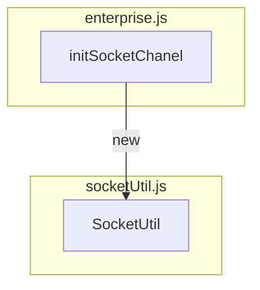
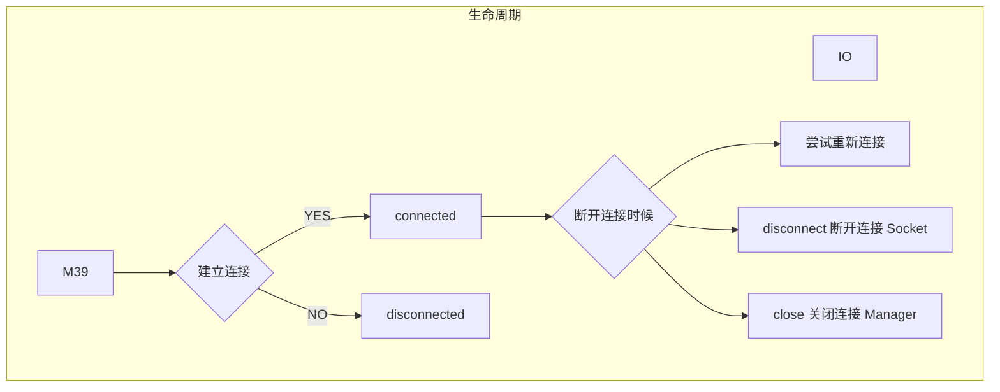

# socketUtil.js

## 方法

| API                                                      | 域名 | url | parem | 描述                     |
| -------------------------------------------------------- | ---- | --- | ----- | ------------------------ |
| normalTempDBMsg                                          | FN   |     |       |                          |
| batchSaveTempMsg                                         | FN   |     |       | 批量事务保存消息提高性能 |
| getMsgpriority                                           | FN   |     |       |                          |
| checkTempMsgAndBatchSend                                 | EA   |     |       |                          |
| removeGIdOfUUID                                          | FN   |     |       |                          |
| disconnectedHandle                                       | EA   |     |       | 重新连接                 |
| SocketUtil                                               | EC   |     |       | socket                   |
| \_init                                                   | EA   |     |       | 初始化                   |
| onClose                                                  | FN   |     |       | 关闭                     |
| [withTimeout](/router/src/api/socketUtil?id=withTimeout) | FN   |     |       | 超时                     |
| [\_sendMsg](/router/src/api/socketUtil?id=_sendMsg)      | EA   |     |       | 发送                     |
| handleMsgStatus                                          | FN   |     |       |                          |
| destory                                                  | FN   |     |       | 注销                     |

### withTimeout

[demo 来自](https://socket.io/docs/v3/emitting-events/)

| 实例超时方法 | 类型   | 描述           |
| ------------ | ------ | -------------- |
| onSuccess    | FN     | 成功的回调方法 |
| onTimeout    | FN     | 超时的回调方法 |
| timeout      | Number | 超时的毫秒数   |

### \_sendMsg

| 给服务端发送消息方法 | 类型   | 描述                                |
| -------------------- | ------ | ----------------------------------- |
| payloadArray         | Array  | 消息内容                            |
| cmd                  | String | 消息类型                            |
| timeout              | Number | 可选（发送消息超时时间），默认 3 秒 |

| 监听              | 类型 | 默认值 | 废弃 | 描述 |
| ----------------- | :--: | :----: | :--: | :--: |
| connect           |      |        |      | 连接 |
| error             |      |        |      | 错误 |
| disconnect        |      |        |      | 连接 |
| connect_error     |      |        |      |      |
| connect_timeout   |      |        |      |      |
| reconnect_attempt |      |        |      |      |
| reconnect_error   |      |        |      |      |
| reconnect_failed  |      |        |      |      |
| reconnecting      |      |        |      | 重连 |
| WPushRes          |      |        |      | 接收 |

### Socket 链接流程



> socket.io-client 2.3.0

> 注意：以下事件是保留的，应用程序不应将其用作事件名称：

1. connect
1. connection
1. connect_error
1. connect_timeout
1. error
1. disconnect
1. disconnecting
1. newListener
1. reconnect_attempt
1. reconnecting
1. reconnect_error
1. reconnect_failed
1. removeListener
1. ping
1. pong

# socket.io-client

Socket.IO 是一个库，可以在客户端和服务器之间实现 低延迟, 双向 和 基于事件的 通信。

[Socket.IO](https://socket.io/zh-CN/docs/v4/)

## 案例

```js
const io = require("socket.io-client");
const socket = io("http://localhost:8888", {
  // reconnection: false, //关闭自动重连
});
console.log(socket.connected); // socket是否与服务器连接
console.log(socket.disconnected); // socket是否与服务器断开连接
socket.open(); // 手动重连
// 连接成功
socket.on("connect", () => {
  console.log(socket.id, "监听客户端连接成功-connect");
});
// 断开连接
socket.on("disconnect", (reason) => {
  console.log(socket.connected);
  console.log("断开连接-disconnect", reason);
});
// 错误
socket.on("error", (err) => {
  console.log("错误-error", err);
});
// 连接错误
socket.on("connect_error", (err) => {
  err;
  console.log("连接错误-connect_error");
});
// 连接超时
socket.on("connect_timeout", (data) => {
  console.log("连接超时-connect_timeout", data);
});
// 重连成功
socket.on("reconnect", (attemptNumber) => {
  // 重连尝试次数
  console.log("重连成功-reconnect", attemptNumber);
});
// 尝试重连时触发
socket.on("reconnect_attempt", (attemptNumber) => {
  // 重连尝试次数
  console.log("尝试重连-reconnect_attempt", attemptNumber);
});
// 在尝试重新连接时触发
socket.on("reconnecting", (attemptNumber) => {
  // 重连尝试次数
  console.log("正在尝试重连-reconnecting", attemptNumber);
});
// 重连尝试错误
socket.on("reconnect_error", (err) => {
  err;
  console.log(socket.connected);
  console.log("重连尝试错误-reconnect_error");
});
// 客户端不能重连时触发
socket.on("reconnect_failed", () => {
  console.log("客户端不能连接-reconnect_failed");
});
// 当一个ping被发送到服务器时触发
socket.on("ping", () => {
  console.log("一个ping发送到服务器-ping");
});

// 当服务器收到pong时触发
socket.on("pong", (data) => {
  // data: 延迟多少ms
  console.log("服务器收到pong-pong", data);
});
```

## 方法

### io 实例化

```js
const io = require("socket.io-client");
const socket = io("http://localhost:8888", {
  //关闭自动重连
  // reconnection: false,
});
```

### connected 是否与服务器连接

```js
socket.connected;
```

### disconnected 是否与服务器断开连接

```js
socket.disconnected;
```

### open 手动重连

```js
socket.open();
```

## 生命周期



## 监听

此事件在断开连接时触发。
| 实例超时方法 | 类型 | 描述 |
| ------------ | ------ | -------------- |
| onSuccess | FN | 成功的回调方法 |
| onTimeout | FN | 超时的回调方法 |
| timeout | Number | 超时的毫秒数 |

## 相关资料

[Node.js 精进（11）——Socket.IO](https://www.pudn.com/news/62da292255398e076bb8e4ea.html)
[Socket.IO](https://socket.io/zh-CN/docs/v4/)
[]()
[]()
[]()
